# 设计模式（Design Pattern）


## 简介 

设计模式（Design pattern）代表了最佳的实践，通常被有经验的面向对象的软件开发人员所采用。设计模式是软件开发人员在软件开发过程中面临的一般问题的解决方案。这些解决方案是众多软件开发人员经过相当长的一段时间的试验和错误总结出来的。

设计模式是一套被反复使用的、多数人知晓的、经过分类编目的、代码设计经验的总结。使用设计模式是为了重用代码、让代码更容易被他人理解、保证代码可靠性。 毫无疑问，设计模式于己于他人于系统都是多赢的，设计模式使代码编制真正工程化，设计模式是软件工程的基石，如同大厦的一块块砖石一样。项目中合理地运用设计模式可以完美地解决很多问题，每种模式在现实中都有相应的原理来与之对应，每种模式都描述了一个在我们周围不断重复发生的问题，以及该问题的核心解决方案，这也是设计模式能被广泛应用的原因。


## 什么是 GOF（四人帮，全拼 Gang of Four）
在 1994 年，由 Erich Gamma、Richard Helm、Ralph Johnson 和 John Vlissides 四人合著出版了一本名为 Design Patterns - Elements of Reusable Object-Oriented Software（中文译名：设计模式 - 可复用的面向对象软件元素） 的书，该书首次提到了软件开发中设计模式的概念。

四位作者合称 GOF（四人帮，全拼 Gang of Four）。他们所提出的设计模式主要是基于以下的面向对象设计原则。

1) 对接口编程而不是对实现编程。
2) 优先使用对象组合而不是继承。


## 设计模式的类型
根据设计模式的参考书 Design Patterns - Elements of Reusable Object-Oriented Software（中文译名：设计模式 - 可复用的面向对象软件元素） 中所提到的，总共有 23 种设计模式。这些模式可以分为三大类：创建型模式（Creational Patterns）、结构型模式（Structural Patterns）、行为型模式（Behavioral Patterns）。

1) 创建型模式

这些设计模式提供了一种在创建对象的同时隐藏创建逻辑的方式，而不是使用 new 运算符直接实例化对象。这使得程序在判断针对某个给定实例需要创建哪些对象时更加灵活。

工厂模式（Factory Pattern）
抽象工厂模式（Abstract Factory Pattern）
单例模式（Singleton Pattern）
建造者模式（Builder Pattern）
原型模式（Prototype Pattern）

2) 结构型模式

这些设计模式关注类和对象的组合。继承的概念被用来组合接口和定义组合对象获得新功能的方式。

适配器模式（Adapter Pattern）
桥接模式（Bridge Pattern）
过滤器模式（Filter、Criteria Pattern）
组合模式（Composite Pattern）
装饰器模式（Decorator Pattern）
外观模式（Facade Pattern）
享元模式（Flyweight Pattern）
代理模式（Proxy Pattern）

3) 行为型模式

这些设计模式特别关注对象之间的通信。

责任链模式（Chain of Responsibility Pattern）
命令模式（Command Pattern）
解释器模式（Interpreter Pattern）
迭代器模式（Iterator Pattern）
中介者模式（Mediator Pattern）
备忘录模式（Memento Pattern）
观察者模式（Observer Pattern）
状态模式（State Pattern）
空对象模式（Null Object Pattern）
策略模式（Strategy Pattern）
模板模式（Template Pattern）
访问者模式（Visitor Pattern）

4) 特殊类型：J2EE 模式

这些设计模式特别关注表示层。这些模式是由 Sun Java Center 鉴定的。

MVC 模式（MVC Pattern）
业务代表模式（Business Delegate Pattern）
组合实体模式（Composite Entity Pattern）
数据访问对象模式（Data Access Object Pattern）
前端控制器模式（Front Controller Pattern）
拦截过滤器模式（Intercepting Filter Pattern）
服务定位器模式（Service Locator Pattern）
传输对象模式（Transfer Object Pattern）

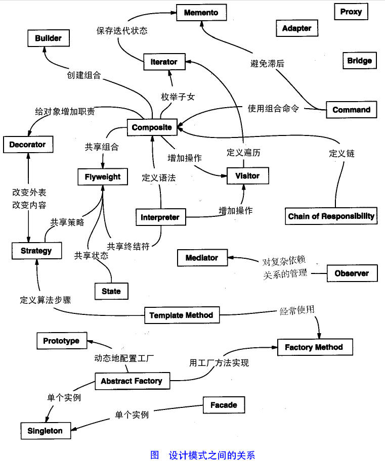


---
## 一、设计模式基本原则

设计模式核心原则基于软件架构的分层切割原理，没有什么是加一层不能解决的。基本原则一般分为以下7种场景：

1) 单一职责原则
2) 接口隔离原则
3) 依赖倒转(倒置)原则
4) 里氏替换原则
5) 开闭原则
6) 迪米特法则
7) 合成复用原则


### 1、单一职责原则（Single responsibility principle）

就一个类而言，应该仅有一个引起它变化的原因。应该只有一个职责。 每一个职责都是变化的一个轴线，如果一个类有一个以上的职责，这些职责就耦合在了一起。这会导致脆弱的设计。当一个职责发生变化时，可能会影响其它的职责。另外，多个职责耦合在一起，会影响复用性。

#### 单一职责原则注意事项和细节
1) 降低类的复杂度，一个类只负责一项职责。
2) 提高类的可读性，可维护性
3) 降低变更引起的风险
4) 通常情况下，我们应当遵守单一职责原则，只有逻辑足够简单，才可以在代码级违反单一职责原则；只有类中方法数量足够少，可以在方法级别保持单一职责原则

示例 ：com.pgman.goku.principle.singleresponsibility.* 


### 2、接口隔离原则(Interface Segregation Principle)

这个原则的意思是：使用多个隔离的接口，比使用单个接口要好。它还有另外一个意思是：降低类之间的耦合度。由此可见，其实设计模式就是从大型软件架构出发、便于升级和维护的软件设计思想，它强调降低依赖，降低耦合。

客户端不应该依赖它不需要的接口，即一个类对另一个类的依应该建立在最小的接口上。

示例 ：com.pgman.goku.principle.segregation.* 


### 3、依赖倒转原则（Dependence Inversion Principle）

依赖倒转原则(Dependence Inversion Principle)是指：
1) 高层模块不应该依赖低层模块，二者都应该依赖其抽象
2) 抽象不应该依赖细节，细节应该依赖抽象
3) 依赖倒转(倒置)的中心思想是面向接口编程
4) 依赖倒转原则是基于这样的设计理念：相对于细节的多变性，抽象的东西要稳定的多。以抽象为基础搭建的架构比以细节为基础的架构要稳定的多。在java中，抽象指的是接口或抽象类，细节就是具体的实现类
5) 使用接口或抽象类的目的是制定好规范，而不涉及任何具体的操作，把展现细节的任务交给他们的实现类去完成

这个原则是开闭原则的基础，具体内容：针对接口编程，依赖于抽象而不依赖于具体。

依赖倒转原则的注意事项和细节
1) 低层模块尽量都要有抽象类或接口，或者两者都有，程序稳定性更好.
2) 变量的声明类型尽量是抽象类或接口, 这样我们的变量引用和实际对象间，就存在一个缓冲层，利于程序扩展和优化
3) 继承时遵循里氏替换原则

示例：com.pgman.goku.principle.inversion.improve.* 


### 4、里氏代换原则（Liskov Substitution Principle）

里氏代换原则是面向对象设计的基本原则之一。 里氏代换原则中说，任何基类可以出现的地方，子类一定可以出现。LSP 是继承复用的基石，只有当派生类可以替换掉基类，且软件单位的功能不受到影响时，基类才能真正被复用，而派生类也能够在基类的基础上增加新的行为。里氏代换原则是对开闭原则的补充。实现开闭原则的关键步骤就是抽象化，而基类与子类的继承关系就是抽象化的具体实现，所以里氏代换原则是对实现抽象化的具体步骤的规范。

#### OO中的继承性的思考和说明
1) 继承包含这样一层含义：父类中凡是已经实现好的方法，实际上是在设定规范和契约，虽然它不强制要求所有的子类必须遵循这些契约，但是如果子类对这些已经实现的方法任意修改，就会对整个继承体系造成破坏。
2) 继承在给程序设计带来便利的同时，也带来了弊端。比如使用继承会给程序带来侵入性，程序的可移植性降低，增加对象间的耦合性，如果一个类被其他的类所继承，则当这个类需要修改时，必须考虑到所有的子类，并且父类修改后，所有涉及到子类的功能都有可能产生故障
3) 问题提出：在编程中，如何正确的使用继承? => 里氏替换原则

#### 基本介绍
1) 里氏替换原则(Liskov Substitution Principle)在1988年，由麻省理工学院的以为姓里的女士提出的。
2) 如果对每个类型为T1的对象o1，都有类型为T2的对象o2，使得以T1定义的所有程序P在所有的对象o1都代换成o2时，程序P的行为没有发生变化，那么类型T2是类型T1的子类型。换句话说，所有引用基类的地方必须能透明地使用其子类的对象。
3) 在使用继承时，遵循里氏替换原则，在子类中尽量不要重写父类的方法
4) 里氏替换原则告诉我们，继承实际上让两个类耦合性增强了，在适当的情况下，可以通过聚合，组合，依赖 来解决问题。

示例：com.pgman.goku.principle.liskov.* 


### 5、开闭原则（Open Close Principle） 

开闭原则的意思是：对扩展开放，对修改关闭。在程序需要进行拓展的时候，不能去修改原有的代码，实现一个热插拔的效果。简言之，是为了使程序的扩展性好，易于维护和升级。想要达到这样的效果，我们需要使用接口和抽象类，后面的具体设计中我们会提到这点。

#### 基本介绍
1) 开闭原则（Open Closed Principle）是编程中最基础、最重要的设计原则
2) 一个软件实体如类，模块和函数应该对扩展开放(对提供方)，对修改关闭(对使用方)。用抽象构建框架，用实现扩展细节。
3) 当软件需要变化时，尽量通过扩展软件实体的行为来实现变化，而不是通过修改已有的代码来实现变化。
4) 编程中遵循其它原则，以及使用设计模式的目的就是遵循开闭原则。

示例：com.pgman.goku.principle.ocp.* 


### 6、迪米特法则，又称最少知道原则（Demeter Principle）

最少知道原则是指：一个实体应当尽量少地与其他实体之间发生相互作用，使得系统功能模块相对独立。

#### 基本介绍
1) 一个对象应该对其他对象保持最少的了解
2) 类与类关系越密切，耦合度越大
3) 迪米特法则(Demeter Principle)又叫最少知道原则，即一个类对自己依赖的类知道的越少越好。也就是说，对于被依赖的类不管多么复杂，都尽量将逻辑封装在类的内部。对外除了提供的public 方法，不对外泄露任何信息
4) 迪米特法则还有个更简单的定义：只与直接的朋友通信
5) 直接的朋友：每个对象都会与其他对象有耦合关系，只要两个对象之间有耦合关系，我们就说这两个对象之间是朋友关系。耦合的方式很多，依赖，关联，组合，聚合等。其中，我们称出现成员变量，方法参数，方法返回值中的类为直接的朋友，而出现在局部变量中的类不是直接的朋友。也就是说，陌生的类最好不要以局部变量的形式出现在类的内部。

#### 迪米特法则注意事项和细节
1) 迪米特法则的核心是降低类之间的耦合
2) 但是注意：由于每个类都减少了不必要的依赖，因此迪米特法则只是要求降低类间(对象间)耦合关系， 并不是要求完全没有依赖关系

示例：com.pgman.goku.principle.demeter.* 


### 7、合成复用原则（Composite Reuse Principle）

合成复用原则是指：尽量使用合成/聚合的方式，而不是使用继承。


### 设计原则核心思想

1) 找出应用中可能需要变化之处，把它们独立出来，不要和那些不需要变化的代码混在一起。
2) 针对接口编程，而不是针对实现编程。
3) 为了交互对象之间的松耦合设计而努力。

--- 

## 二、UML 

统一建模语言（Unified Modeling Language，UML）是用来设计软件蓝图的可视化建模语言，1997 年被国际对象管理组织（OMG）采纳为面向对象的建模语言的国际标准。它的特点是简单、统一、图形化、能表达软件设计中的动态与静态信息。

统一建模语言能为软件开发的所有阶段提供模型化和可视化支持。而且融入了软件工程领域的新思想、新方法和新技术，使软件设计人员沟通更简明，进一步缩短了设计时间，减少开发成本。它的应用领域很宽，不仅适合于一般系统的开发，而且适合于并行与分布式系统的建模。

UML 从目标系统的不同角度出发，定义了用例图、类图、对象图、状态图、活动图、时序图、协作图、构件图、部署图等 9 种图。

类图（ClassDiagram）是用来显示系统中的类、接口、协作以及它们之间的静态结构和关系的一种静态模型。它主要用于描述软件系统的结构化设计，帮助人们简化对软件系统的理解，它是系统分析与设计阶段的重要产物，也是系统编码与测试的重要模型依据。

类之间的关系：

在软件系统中，类不是孤立存在的，类与类之间存在各种关系。根据类与类之间的耦合度从弱到强排列，UML 中的类图有以下几种关系：依赖关系、关联关系、聚合关系、组合关系、泛化关系和实现关系。其中泛化和实现的耦合度相等，它们是最强的。

1) 依赖关系

依赖（Dependency）关系是一种使用关系，它是对象之间耦合度最弱的一种关联方式，是临时性的关联。在代码中，某个类的方法通过局部变量、方法的参数或者对静态方法的调用来访问另一个类（被依赖类）中的某些方法来完成一些职责。

在 UML 类图中，依赖关系使用带箭头的虚线来表示，箭头从使用类指向被依赖的类。下图 所示是人与手机的关系图，人通过手机的语音传送方法打电话。

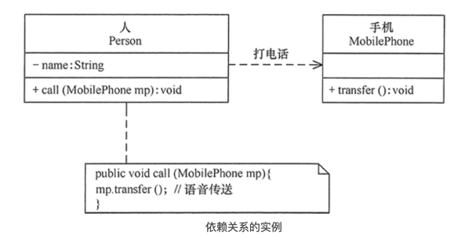

2) 关联关系

关联（Association）关系是对象之间的一种引用关系，用于表示一类对象与另一类对象之间的联系，如老师和学生、师傅和徒弟、丈夫和妻子等。关联关系是类与类之间最常用的一种关系，分为一般关联关系、聚合关系和组合关系。我们先介绍一般关联。

关联可以是双向的，也可以是单向的。在 UML 类图中，双向的关联可以用带两个箭头或者没有箭头的实线来表示，单向的关联用带一个箭头的实线来表示，箭头从使用类指向被关联的类。也可以在关联线的两端标注角色名，代表两种不同的角色。

在代码中通常将一个类的对象作为另一个类的成员变量来实现关联关系。下图 所示是老师和学生的关系图，每个老师可以教多个学生，每个学生也可向多个老师学，他们是双向关联。

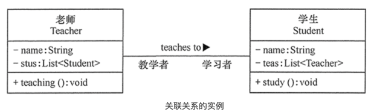

3) 聚合关系

聚合（Aggregation）关系是关联关系的一种，是强关联关系，是整体和部分之间的关系，是 has-a 的关系。

聚合关系也是通过成员对象来实现的，其中成员对象是整体对象的一部分，但是成员对象可以脱离整体对象而独立存在。例如，学校与老师的关系，学校包含老师，但如果学校停办了，老师依然存在。

在 UML 类图中，聚合关系可以用带空心菱形的实线来表示，菱形指向整体。下图 所示是大学和教师的关系图。

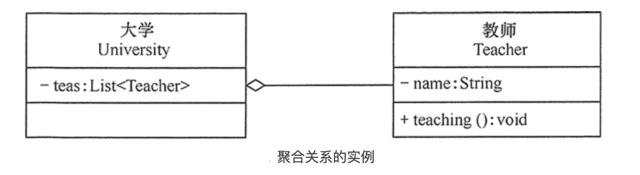

4) 组合关系

组合（Composition）关系也是关联关系的一种，也表示类之间的整体与部分的关系，但它是一种更强烈的聚合关系，是 cxmtains-a 关系。

在组合关系中，整体对象可以控制部分对象的生命周期，一旦整体对象不存在，部分对象也将不存在，部分对象不能脱离整体对象而存在。例如，头和嘴的关系，没有了头，嘴也就不存在了。

在 UML 类图中，组合关系用带实心菱形的实线来表示，菱形指向整体。下图 所示是头和嘴的关系图。

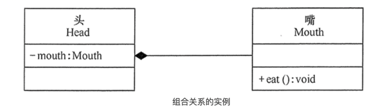


5) 泛化关系 

泛化（Generalization）关系是对象之间耦合度最大的一种关系，表示一般与特殊的关系，是父类与子类之间的关系，是一种继承关系，是 is-a 的关系。

在 UML 类图中，泛化关系用带空心三角箭头的实线来表示，箭头从子类指向父类。在代码实现时，使用面向对象的继承机制来实现泛化关系。例如，Student 类和 Teacher 类都是 Person 类的子类，其类图如下图所示。

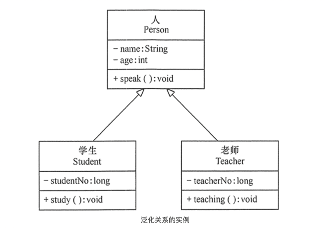

6) 实现关系 

实现（Realization）关系是接口与实现类之间的关系。在这种关系中，类实现了接口，类中的操作实现了接口中所声明的所有的抽象操作。

在 UML 类图中，实现关系使用带空心三角箭头的虚线来表示，箭头从实现类指向接口。例如，汽车和船实现了交通工具，其类图如下图所示。

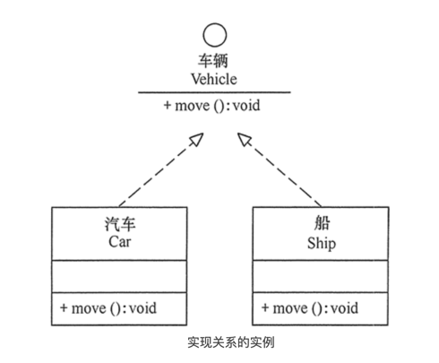


示例：com.pgman.goku.uml.* 


--- 

### 三、设计模式 

#### 掌握设计模式的层次

1) 第1层：刚开始学编程不久，听说过什么是设计模式
2) 第2层：有很长时间的编程经验，自己写了很多代码，其中用到了设计模式，但是自己却不知道
3) 第3层：学习过了设计模式，发现自己已经在使用了，并且发现了一些新的模式挺好用的
4) 第4层：阅读了很多别人写的源码和框架，在其中看到别人设计模式，并且能够领会设计模式的精妙和带来的好处。
5) 第5层：代码写着写着，自己都没有意识到使用了设计模式，并且熟练的写了出来。

#### 设计模式介绍

1) 设计模式是程序员在面对同类软件工程设计问题所总结出来的有用的经验，模式不是代码，而是某类问题的通用解决方案，设计模式（Design pattern）代表了最佳的实践。这些解决方案是众多软件开发人员经过相当长的一段时间的试验和错误总结出来的。
2) 设计模式的本质提高 软件的维护性，通用性和扩展性，并降低软件的复杂度。
3) <<设计模式>> 是经典的书，作者是 Erich Gamma、Richard Helm、Ralph Johnson 和 John Vlissides Design（俗称 “四人组 GOF”）
4) 设计模式并不局限于某种语言，java，php，c++ 都有设计模式.

#### 设计模式类型

设计模式分为三种类型，共23种
1) 创建型模式：单例模式、抽象工厂模式、原型模式、建造者模式、工厂模式。
2) 结构型模式：适配器模式、桥接模式、装饰模式、组合模式、外观模式、享元模式、代理模式。
3) 行为型模式：模版方法模式、命令模式、访问者模式、迭代器模式、观察者模式、中介者模式、备忘录模式、解释器模式（Interpreter模式）、状态模式、策略模式、职责链模式(责任链模式)。 
   
注意：不同的书籍上对分类和名称略有差别

--- 

#### 1、单例设计模式 

所谓类的单例设计模式，就是采取一定的方法保证在整个的软件系统中，对某个类只能存在一个对象实例，并且该类只提供一个取得其对象实例的方法(静态方法)。

单例模式（Singleton Pattern）是 Java 中最简单的设计模式之一。这种类型的设计模式属于创建型模式，它提供了一种创建对象的最佳方式。

这种模式涉及到一个单一的类，该类负责创建自己的对象，同时确保只有单个对象被创建。这个类提供了一种访问其唯一的对象的方式，可以直接访问，不需要实例化该类的对象。

注意：

1) 单例类只能有一个实例。
2) 单例类必须自己创建自己的唯一实例。
3) 单例类必须给所有其他对象提供这一实例。

介绍 : 

意图：保证一个类仅有一个实例，并提供一个访问它的全局访问点。

主要解决：一个全局使用的类频繁地创建与销毁。

何时使用：当您想控制实例数目，节省系统资源的时候。

如何解决：判断系统是否已经有这个单例，如果有则返回，如果没有则创建。

关键代码：构造函数是私有的。

应用实例：

1) 一个班级只有一个班主任。
2) Windows 是多进程多线程的，在操作一个文件的时候，就不可避免地出现多个进程或线程同时操作一个文件的现象，所以所有文件的处理必须通过唯一的实例来进行。
3) 一些设备管理器常常设计为单例模式，比如一个电脑有两台打印机，在输出的时候就要处理不能两台打印机打印同一个文件。

优点：

1、在内存里只有一个实例，减少了内存的开销，尤其是频繁的创建和销毁实例（比如管理学院首页页面缓存）。

2、避免对资源的多重占用（比如写文件操作）。

缺点：

没有接口，不能继承，与单一职责原则冲突，一个类应该只关心内部逻辑，而不关心外面怎么样来实例化。

使用场景：

1) 要求生产唯一序列号。
2) WEB 中的计数器，不用每次刷新都在数据库里加一次，用单例先缓存起来。
3) 创建的一个对象需要消耗的资源过多，比如 I/O 与数据库的连接等。

实现 : 

我们将创建一个 SingleObject 类。SingleObject 类有它的私有构造函数和本身的一个静态实例。

SingleObject 类提供了一个静态方法，供外界获取它的静态实例。SingletonPatternDemo 类使用 SingleObject 类来获取 SingleObject 对象。

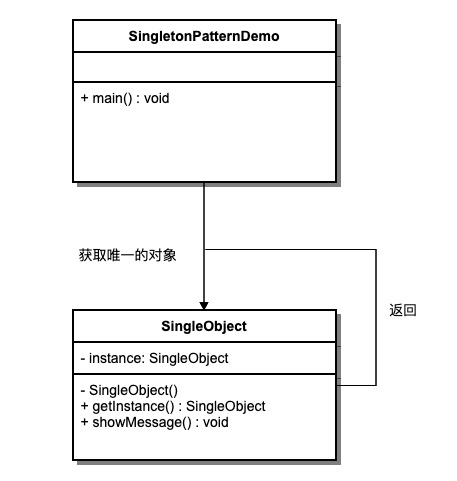

1、创建一个 Singleton 类。

```java
public class SingleObject {
 
   //创建 SingleObject 的一个对象
   private static SingleObject instance = new SingleObject();
 
   //让构造函数为 private，这样该类就不会被实例化
   private SingleObject(){}
 
   //获取唯一可用的对象
   public static SingleObject getInstance(){
      return instance;
   }
 
   public void showMessage(){
      System.out.println("Hello World!");
   }
}
```

2、从 singleton 类获取唯一的对象。
```java
public class SingletonPatternDemo {
   public static void main(String[] args) {
 
      //不合法的构造函数
      //编译时错误：构造函数 SingleObject() 是不可见的
      //SingleObject object = new SingleObject();
 
      //获取唯一可用的对象
      SingleObject object = SingleObject.getInstance();
 
      //显示消息
      object.showMessage();
   }
}
```


##### 单例模式的八种实现方式：
###### 1) 饿汉式(静态常量) 

####### 步骤如下：
1) 构造器私有化 (防止 new )
2) 类的内部创建对象
3) 向外暴露一个静态的公共方法，getInstance

示例代码：com.pgman.goku.dp23.singleton.type1.SingletonType1

####### 优缺点说明：
1) 优点：这种写法比较简单，就是在类装载的时候就完成实例化。避免了线程同步问题。
2) 缺点：在类装载的时候就完成实例化，没有达到Lazy Loading的效果。如果从始至终从未使用过这个实例，则会造成内存的浪费
3) 这种方式基于classloder机制避免了多线程的同步问题，不过，instance在类装载时就实例化，在单例模式中大多数都是调用getInstance方法， 但是导致类装载的原因有很多种，因此不能确定有其他的方式（或者其他的静态方法）导致类装载，这时候初始化instance就没有达到lazy loading的效果
4) 结论：这种单例模式可用，可能造成内存浪费
   
###### 2) 饿汉式（静态代码块）

####### 步骤如下：
1) 构造器私有化 (防止 new )
2) 类的内部创建对象，在静态代码块中创建单例对象 
3) 向外暴露一个静态的公共方法，getInstance

示例代码：com.pgman.goku.dp23.singleton.type2.SingletonType2 

####### 优缺点说明：
1) 这种方式和上面的方式其实类似，只不过将类实例化的过程放在了静态代码块中，也是在类装载的时候，就执行静态代码块中的代码，初始化类的实例。优缺点和上面是一样的。
2) 结论：这种单例模式可用，但是可能造成内存浪费

###### 3) 懒汉式(线程不安全)

示例代码：com.pgman.goku.dp23.singleton.type3.SingletonType3 

####### 优缺点说明：
1) 起到了Lazy Loading的效果，但是只能在单线程下使用。
2) 如果在多线程下，一个线程进入了if (singleton == null)判断语句块，还未来得及往下执行，另一个线程也通过了这个判断语句，这时便会产生多个实例。所以在多线程环境下不可使用这种方式
3) 结论：在实际开发中，<b>不要</b>使用这种方式.


###### 4) 懒汉式(线程安全，同步方法)

示例代码：com.pgman.goku.dp23.singleton.type4.SingletonType4 

####### 优缺点说明：
1) 解决了线程不安全问题
2) 效率太低了，每个线程在想获得类的实例时候，执行getInstance()方法都要进行同步。而其实这个方法只执行一次实例化代码就够了，后面的想获得该类实例，直接return就行了。方法进行同步效率太低
3) 优点：第一次调用才初始化，避免内存浪费。
   缺点：必须加锁 synchronized 才能保证单例，但加锁会影响效率。
   结论：在实际开发中，不推荐使用这种方式
   

###### 5) 懒汉式(线程安全，同步代码块)

示例代码：com.pgman.goku.dp23.singleton.type5.SingletonType5

####### 优缺点说明：
1) 这种方式，本意是想对第四种实现方式的改进，因为前面同步方法效率太低，改为同步产生实例化的的代码块
2) 但是这种同步并不能起到线程同步的作用。跟第3种实现方式遇到的情形一致，假如一个线程进入了if (singleton == null)判断语句块，还未来得及往下执行，
   另一个线程也通过了这个判断语句，这时便会产生多个实例
3) 结论：在实际开发中，不能使用这种方式

###### 6) 双检锁/双重校验锁（DCL，即 double-checked locking）

示例代码：com.pgman.goku.dp23.singleton.type6.SingletonType6

####### 优缺点说明：
1) Double-Check概念是多线程开发中常使用到的，如代码中所示，我们进行了两次if (singleton == null)检查，这样就可以保证线程安全了。
2) 这样，实例化代码只用执行一次，后面再次访问时，判断if (singleton == null)，直接return实例化对象，也避免的反复进行方法同步.
3) 线程安全；延迟加载；效率较高
4) 结论：在实际开发中，推荐使用这种单例设计模式

###### 7) 静态内部类 

示例代码：com.pgman.goku.dp23.singleton.type7.SingletonType7

####### 优缺点说明：
1) 这种方式采用了类装载的机制来保证初始化实例时只有一个线程。
2) 静态内部类方式在Singleton类被装载时并不会立即实例化，而是在需要实例化时，调用getInstance方法，才会装载SingletonInstance类，从而完成Singleton的实例化。
3) 类的静态属性只会在第一次加载类的时候初始化，所以在这里，JVM帮助我们保证了线程的安全性，在类进行初始化时，别的线程是无法进入的。
4) 优点：避免了线程不安全，利用静态内部类特点实现延迟加载，效率高
5) 结论：推荐使用.


###### 8) 枚举

示例代码：com.pgman.goku.dp23.singleton.type8.SingletonType8

优缺点说明：
1) 这借助JDK1.5中添加的枚举来实现单例模式。不仅能避免多线程同步问题，而且还能防止反序列化重新创建新的对象。这种实现方式还没有被广泛采用，但这是实现单例模式的最佳方法。它更简洁，自动支持序列化机制，绝对防止多次实例化。
2) 这种方式是Effective Java作者Josh Bloch 提倡的方式，这种方式是 Effective Java 作者 Josh Bloch 提倡的方式，它不仅能避免多线程同步问题，而且还自动支持序列化机制，防止反序列化重新创建新的对象，绝对防止多次实例化。不过，由于 JDK1.5 之后才加入 enum 特性，用这种方式写不免让人感觉生疏，在实际工作中，也很少用。
   不能通过 reflection attack 来调用私有构造方法。
3) 结论：推荐使用


##### 单例模式注意事项和细节说明
1) 单例模式保证了 系统内存中该类只存在一个对象，节省了系统资源，对于一些需要频繁创建销毁的对象，使用单例模式可以提高系统性能
2) 当想实例化一个单例类的时候，必须要记住使用相应的获取对象的方法，而不是使用new
3) 单例模式使用的场景：需要频繁的进行创建和销毁的对象、创建对象时耗时过多或耗费资源过多(即：重量级对象)，但又经常用到的对象、工具类对象、频繁访问数据库或文件的对象(比如数据源、session工厂等)


#### 2、工厂设计模式 

工厂模式（Factory Pattern）是 Java 中最常用的设计模式之一。这种类型的设计模式属于创建型模式，它提供了一种创建对象的最佳方式。在工厂模式中，我们在创建对象时不会对客户端暴露创建逻辑，并且是通过使用一个共同的接口来指向新创建的对象。

##### 介绍 

意图：定义一个创建对象的接口，让其子类自己决定实例化哪一个工厂类，工厂模式使其创建过程延迟到子类进行。

主要解决：主要解决接口选择的问题。

何时使用：我们明确地计划不同条件下创建不同实例时。

如何解决：让其子类实现工厂接口，返回的也是一个抽象的产品。

关键代码：创建过程在其子类执行。

应用实例： 
1) 您需要一辆汽车，可以直接从工厂里面提货，而不用去管这辆汽车是怎么做出来的，以及这个汽车里面的具体实现。
2) Hibernate 换数据库只需换方言和驱动就可以。

优点： 

1、一个调用者想创建一个对象，只要知道其名称就可以了。 

2、扩展性高，如果想增加一个产品，只要扩展一个工厂类就可以。 

3、屏蔽产品的具体实现，调用者只关心产品的接口。

缺点：

每次增加一个产品时，都需要增加一个具体类和对象实现工厂，使得系统中类的个数成倍增加，在一定程度上增加了系统的复杂度，同时也增加了系统具体类的依赖。这并不是什么好事。

使用场景： 

1、日志记录器：记录可能记录到本地硬盘、系统事件、远程服务器等，用户可以选择记录日志到什么地方。 

2、数据库访问，当用户不知道最后系统采用哪一类数据库，以及数据库可能有变化时。 

3、设计一个连接服务器的框架，需要三个协议，"POP3"、"IMAP"、"HTTP"，可以把这三个作为产品类，共同实现一个接口。


注意事项：

作为一种创建类模式，在任何需要生成复杂对象的地方，都可以使用工厂方法模式。有一点需要注意的地方就是复杂对象适合使用工厂模式，而简单对象，特别是只需要通过 new 就可以完成创建的对象，无需使用工厂模式。如果使用工厂模式，就需要引入一个工厂类，会增加系统的复杂度。


工厂设计模式包括3种类型：

1) 简单工厂模式

基本介绍
1) 简单工厂模式是属于创建型模式，是工厂模式的一种。简单工厂模式是由一个工厂对象决定创建出哪一种产品类的实例。简单工厂模式是工厂模式家族中最简单实用的模式
2) 简单工厂模式：定义了一个创建对象的类，由这个类来封装实例化对象的行为(代码)
3) 在软件开发中，当我们会用到大量的创建某种、某类或者某批对象时，就会使用到工厂模式.

示例代码：com.pgman.goku.dp23.factory.simple.*

2) 工厂方法模式

定义了一个创建对象的抽象方法，由子类决定要实例化的类。工厂方法模式将对象的实例化推迟到子类。

示例代码：com.pgman.goku.dp23.factory.method.*

3) 抽象工厂模式 

抽象工厂模式（Abstract Factory Pattern）是围绕一个超级工厂创建其他工厂。该超级工厂又称为其他工厂的工厂。这种类型的设计模式属于创建型模式，它提供了一种创建对象的最佳方式。

在抽象工厂模式中，接口是负责创建一个相关对象的工厂，不需要显式指定它们的类。每个生成的工厂都能按照工厂模式提供对象。

基本原理
1) 抽象工厂模式：定义了一个interface用于创建相关或有依赖关系的对象簇，而无需指明具体的类
2) 抽象工厂模式可以将简单工厂模式和工厂方法模式进行整合。
3) 从设计层面看，抽象工厂模式就是对简单工厂模式的改进(或者称为进一步的抽象)。
4) 将工厂抽象成两层，AbsFactory(抽象工厂) 和 具体实现的工厂子类。程序员可以根据创建对象类型使用对应的工厂子类。这样将单个的简单工厂类变成了工厂簇，更利于代码的维护和扩展。

介绍

意图：提供一个创建一系列相关或相互依赖对象的接口，而无需指定它们具体的类。

主要解决：主要解决接口选择的问题。

何时使用：系统的产品有多于一个的产品族，而系统只消费其中某一族的产品。

如何解决：在一个产品族里面，定义多个产品。

关键代码：在一个工厂里聚合多个同类产品。

应用实例：工作了，为了参加一些聚会，肯定有两套或多套衣服吧，比如说有商务装（成套，一系列具体产品）、时尚装（成套，一系列具体产品），甚至对于一个家庭来说，可能有商务女装、商务男装、时尚女装、时尚男装，这些也都是成套的，即一系列具体产品。假设一种情况（现实中是不存在的，要不然，没法进入共产主义了，但有利于说明抽象工厂模式），在您的家中，某一个衣柜（具体工厂）只能存放某一种这样的衣服（成套，一系列具体产品），每次拿这种成套的衣服时也自然要从这个衣柜中取出了。用 OOP 的思想去理解，所有的衣柜（具体工厂）都是衣柜类的（抽象工厂）某一个，而每一件成套的衣服又包括具体的上衣（某一具体产品），裤子（某一具体产品），这些具体的上衣其实也都是上衣（抽象产品），具体的裤子也都是裤子（另一个抽象产品）。

优点：当一个产品族中的多个对象被设计成一起工作时，它能保证客户端始终只使用同一个产品族中的对象。

缺点：产品族扩展非常困难，要增加一个系列的某一产品，既要在抽象的 Creator 里加代码，又要在具体的里面加代码。

使用场景： 1、QQ 换皮肤，一整套一起换。 2、生成不同操作系统的程序。

注意事项：产品族难扩展，产品等级易扩展。

示例代码：com.pgman.goku.dp23.factory.abs.*


##### 工厂模式小结
1) 工厂模式的意义

将实例化对象的代码提取出来，放到一个类中统一管理和维护，达到和主项目的依赖关系的解耦。从而提高项目的扩展和维护性。

2) 三种工厂模式 (简单工厂模式、工厂方法模式、抽象工厂模式)

3) 设计模式的依赖抽象原则

创建对象实例时，不要直接 new 类, 而是把这个new 类的动作放在一个工厂的方法中，并返回。有的书上说，变量不要直接持有具体类的引用。

不要让类继承具体类，而是继承抽象类或者是实现interface(接口) 

不要覆盖基类中已经实现的方法。


#### 3、原型模式 

原型模式（Prototype Pattern）是用于创建重复的对象，同时又能保证性能。这种类型的设计模式属于创建型模式，它提供了一种创建对象的最佳方式。

这种模式是实现了一个原型接口，该接口用于创建当前对象的克隆。当直接创建对象的代价比较大时，则采用这种模式。例如，一个对象需要在一个高代价的数据库操作之后被创建。我们可以缓存该对象，在下一个请求时返回它的克隆，在需要的时候更新数据库，以此来减少数据库调用。


###### 介绍
意图：用原型实例指定创建对象的种类，并且通过拷贝这些原型创建新的对象。

1) 原型模式(Prototype模式)是指：用原型实例指定创建对象的种类，并且通过拷贝这些原型，创建新的对象
2) 原型模式是一种创建型设计模式，允许一个对象再创建另外一个可定制的对象，无需知道如何创建的细节
3) 工作原理是:通过将一个原型对象传给那个要发动创建的对象，这个要发动创建的对象通过请求原型对象拷贝它们自己来实施创建，即 对象.clone()
   
主要解决：在运行期建立和删除原型。

何时使用：
1) 当一个系统应该独立于它的产品创建，构成和表示时。 
2) 当要实例化的类是在运行时刻指定时，例如，通过动态装载。 
3) 为了避免创建一个与产品类层次平行的工厂类层次时。 
4) 当一个类的实例只能有几个不同状态组合中的一种时。建立相应数目的原型并克隆它们可能比每次用合适的状态手工实例化该类更方便一些。

如何解决：利用已有的一个原型对象，快速地生成和原型对象一样的实例。

关键代码： 
1) 实现克隆操作，在 JAVA 继承 Cloneable，重写 clone()，在 .NET 中可以使用 Object 类的 MemberwiseClone() 方法来实现对象的浅拷贝或通过序列化的方式来实现深拷贝。 
2) 原型模式同样用于隔离类对象的使用者和具体类型（易变类）之间的耦合关系，它同样要求这些"易变类"拥有稳定的接口。

应用实例： 
1) 细胞分裂。 
2) JAVA 中的 Object clone() 方法。

优点： 
1) 性能提高。 
2) 逃避构造函数的约束。

缺点： 
1) 配备克隆方法需要对类的功能进行通盘考虑，这对于全新的类不是很难，但对于已有的类不一定很容易，特别当一个类引用不支持串行化的间接对象，或者引用含有循环结构的时候。 
2) 必须实现 Cloneable 接口。

使用场景： 
1) 资源优化场景。 
2) 类初始化需要消化非常多的资源，这个资源包括数据、硬件资源等。 
3) 性能和安全要求的场景。 
4) 通过 new 产生一个对象需要非常繁琐的数据准备或访问权限，则可以使用原型模式。 
5) 一个对象多个修改者的场景。 
6) 一个对象需要提供给其他对象访问，而且各个调用者可能都需要修改其值时，可以考虑使用原型模式拷贝多个对象供调用者使用。 
7) 在实际项目中，原型模式很少单独出现，一般是和工厂方法模式一起出现，通过 clone 的方法创建一个对象，然后由工厂方法提供给调用者。原型模式已经与 Java 融为浑然一体，大家可以随手拿来使用。

注意事项：与通过对一个类进行实例化来构造新对象不同的是，原型模式是通过拷贝一个现有对象生成新对象的。浅拷贝实现 Cloneable，重写，深拷贝是通过实现 Serializable 读取二进制流。

##### 深入讨论-浅拷贝和深拷贝

浅拷贝的介绍
1) 对于数据类型是基本数据类型的成员变量，浅拷贝会直接进行值传递，也就是将该属性值复制一份给新的对象。
2) 对于数据类型是引用数据类型的成员变量，比如说成员变量是某个数组、某个类的对象等，那么浅拷贝会进行引用传递，也就是只是将该成员变量的引用值（内存地址）复制一份给新的对象。因为实际上两个对象的该成员变量都指向同一个实例。在这种情况下，在一个对象中修改该成员变量会影响到另一个对象的该成员变量值
3) 浅拷贝是使用默认的 clone()方法来实现 sheep = (Sheep) super.clone();

深拷贝基本介绍
1) 复制对象的所有基本数据类型的成员变量值
2) 为所有引用数据类型的成员变量申请存储空间，并复制每个引用数据类型成员变量所引用的对象，直到该对象可达的所有对象。也就是说，对象进行深拷贝要对整个对象进行拷贝
3) 深拷贝实现方式1：重写clone方法来实现深拷贝
4) 深拷贝实现方式2：通过对象序列化实现深拷贝(推荐)

##### 原型模式的注意事项和细节
1) 创建新的对象比较复杂时，可以利用原型模式简化对象的创建过程，同时也能够提高效率
2) 不用重新初始化对象，而是动态地获得对象运行时的状态
3) 如果原始对象发生变化(增加或者减少属性)，其它克隆对象的也会发生相应的变化，无需修改代码
4) 在实现深克隆的时候可能需要比较复杂的代码
5) 缺点：需要为每一个类配备一个克隆方法，这对全新的类来说不是很难，但对已有的类进行改造时，需要修改其源代码，违背了ocp原则，这点请同学们注意.


#### 4、建造者模式 

建造者模式（Builder Pattern）使用多个简单的对象一步一步构建成一个复杂的对象。这种类型的设计模式属于创建型模式，它提供了一种创建对象的最佳方式。

一个 Builder 类会一步一步构造最终的对象。该 Builder 类是独立于其他对象的。 

1) 建造者模式（Builder Pattern） 又叫生成器模式，是一种对象构建模式。它可以将复杂对象的建造过程抽象出来（抽象类别），使这个抽象过程的不同实现方法可以构造出不同表现（属性）的对象。
2) 建造者模式 是一步一步创建一个复杂的对象，它允许用户只通过指定复杂对象的类型和内容就可以构建它们，用户不需要知道内部的具体构建细节。
   
##### 介绍
意图：将一个复杂的构建与其表示相分离，使得同样的构建过程可以创建不同的表示。

主要解决：主要解决在软件系统中，有时候面临着"一个复杂对象"的创建工作，其通常由各个部分的子对象用一定的算法构成；由于需求的变化，这个复杂对象的各个部分经常面临着剧烈的变化，但是将它们组合在一起的算法却相对稳定。

何时使用：一些基本部件不会变，而其组合经常变化的时候。

如何解决：将变与不变分离开。

关键代码：建造者：创建和提供实例，导演：管理建造出来的实例的依赖关系。

应用实例： 1、去肯德基，汉堡、可乐、薯条、炸鸡翅等是不变的，而其组合是经常变化的，生成出所谓的"套餐"。 2、JAVA 中的 StringBuilder。

优点： 1、建造者独立，易扩展。 2、便于控制细节风险。

缺点： 1、产品必须有共同点，范围有限制。 2、如内部变化复杂，会有很多的建造类。

使用场景： 1、需要生成的对象具有复杂的内部结构。 2、需要生成的对象内部属性本身相互依赖。

注意事项：与工厂模式的区别是：建造者模式更加关注与零件装配的顺序。

##### 建造者模式的四个角色
1) Product（产品角色）： 一个具体的产品对象。
2) Builder（抽象建造者）： 创建一个Product对象的各个部件指定的 接口/抽象类。
3) ConcreteBuilder（具体建造者）： 实现接口，构建和装配各个部件。
4) Director（指挥者）： 构建一个使用Builder接口的对象。它主要是用于创建一个复杂的对象。它主要有两个作用，一是：隔离了客户与对象的生产过程，二是：负责控制产品对象的生产过程。

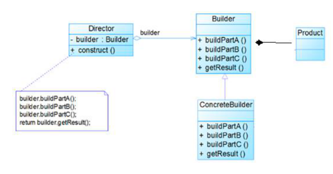

##### 来自菜鸟的一个案例：

我们假设一个快餐店的商业案例，其中，一个典型的套餐可以是一个汉堡（Burger）和一杯冷饮（Cold drink）。汉堡（Burger）可以是素食汉堡（Veg Burger）或鸡肉汉堡（Chicken Burger），它们是包在纸盒中。冷饮（Cold drink）可以是可口可乐（coke）或百事可乐（pepsi），它们是装在瓶子中。

我们将创建一个表示食物条目（比如汉堡和冷饮）的 Item 接口和实现 Item 接口的实体类，以及一个表示食物包装的 Packing 接口和实现 Packing 接口的实体类，汉堡是包在纸盒中，冷饮是装在瓶子中。

然后我们创建一个 Meal 类，带有 Item 的 ArrayList 和一个通过结合 Item 来创建不同类型的 Meal 对象的 MealBuilder。BuilderPatternDemo 类使用 MealBuilder 来创建一个 Meal。

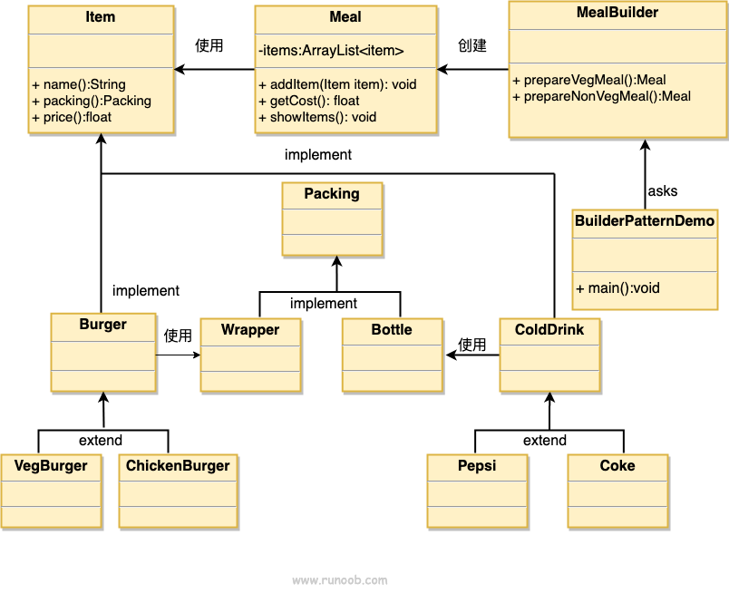

示例代码：com.pgman.goku.dp23.builder.*

##### 建造者模式的注意事项和细节
1) 客户端(使用程序)不必知道产品内部组成的细节，将产品本身与产品的创建过程解耦，使得相同的创建过程可以创建不同的产品对象
2) 每一个具体建造者都相对独立，而与其他的具体建造者无关，因此可以很方便地替换具体建造者或增加新的具体建造者， 用户使用不同的具体建造者即可得到不同的产品对象
3) 可以更加精细地控制产品的创建过程 。将复杂产品的创建步骤分解在不同的方法中，使得创建过程更加清晰，也更方便使用程序来控制创建过程
4) 增加新的具体建造者无须修改原有类库的代码，指挥者类针对抽象建造者类编程，系统扩展方便，符合 “开闭原则”.
5) 建造者模式所创建的产品一般具有较多的共同点，其组成部分相似，如果产品之间的差异性很大，则不适合使用建造者模式，因此其使用范围受到一定的限制。
6) 如果产品的内部变化复杂，可能会导致需要定义很多具体建造者类来实现这种变化，导致系统变得很庞大，因此在这种情况下，要考虑是否选择建造者模式.
7) 抽象工厂模式VS建造者模式 ： 抽象工厂模式实现对产品家族的创建，一个产品家族是这样的一系列产品：具有不同分类维度的产品组合，采用抽象工厂模式不需要关心构建过程，只关心什么产品由什么工厂生产即可。而建造者模式则是要求按照指定的蓝图建造产品，它的主要目的是通过组装零配件而产生一个新产品

#### 5、适配器模式 

适配器模式（Adapter Pattern）是作为两个不兼容的接口之间的桥梁。这种类型的设计模式属于结构型模式，它结合了两个独立接口的功能。

这种模式涉及到一个单一的类，该类负责加入独立的或不兼容的接口功能。举个真实的例子，读卡器是作为内存卡和笔记本之间的适配器。您将内存卡插入读卡器，再将读卡器插入笔记本，这样就可以通过笔记本来读取内存卡。

1) 适配器模式(Adapter Pattern)将某个类的接口转换成客户端期望的另一个接口表示，主的目的是兼容性，让原本因接口不匹配不能一起工作的两个类可以协同工作。其别名为包装器(Wrapper)
2) 适配器模式属于结构型模式
3) 主要分为三类：类适配器模式、对象适配器模式、接口适配器模式

##### 介绍 

意图：将一个类的接口转换成客户希望的另外一个接口。适配器模式使得原本由于接口不兼容而不能一起工作的那些类可以一起工作。

主要解决：主要解决在软件系统中，常常要将一些"现存的对象"放到新的环境中，而新环境要求的接口是现对象不能满足的。

何时使用： 1、系统需要使用现有的类，而此类的接口不符合系统的需要。 2、想要建立一个可以重复使用的类，用于与一些彼此之间没有太大关联的一些类，包括一些可能在将来引进的类一起工作，这些源类不一定有一致的接口。 3、通过接口转换，将一个类插入另一个类系中。（比如老虎和飞禽，现在多了一个飞虎，在不增加实体的需求下，增加一个适配器，在里面包容一个虎对象，实现飞的接口。）

如何解决：继承或依赖（推荐）。

关键代码：适配器继承或依赖已有的对象，实现想要的目标接口。

应用实例： 1、美国电器 110V，中国 220V，就要有一个适配器将 110V 转化为 220V。 2、JAVA JDK 1.1 提供了 Enumeration 接口，而在 1.2 中提供了 Iterator 接口，想要使用 1.2 的 JDK，则要将以前系统的 Enumeration 接口转化为 Iterator 接口，这时就需要适配器模式。 3、在 LINUX 上运行 WINDOWS 程序。 4、JAVA 中的 jdbc。

优点： 1、可以让任何两个没有关联的类一起运行。 2、提高了类的复用。 3、增加了类的透明度。 4、灵活性好。

缺点： 1、过多地使用适配器，会让系统非常零乱，不易整体进行把握。比如，明明看到调用的是 A 接口，其实内部被适配成了 B 接口的实现，一个系统如果太多出现这种情况，无异于一场灾难。因此如果不是很有必要，可以不使用适配器，而是直接对系统进行重构。 2.由于 JAVA 至多继承一个类，所以至多只能适配一个适配者类，而且目标类必须是抽象类。

使用场景：有动机地修改一个正常运行的系统的接口，这时应该考虑使用适配器模式。

工作原理：
1) 适配器模式：将一个类的接口转换成另一种接口.让原本接口不兼容的类可以兼 容
2) 从用户的角度看不到被适配者，是解耦的
3) 用户调用适配器转化出来的目标接口方法，适配器再调用被适配者的相关接口方法
4) 用户收到反馈结果，感觉只是和目标接口交互

注意事项：适配器不是在详细设计时添加的，而是解决正在服役的项目的问题。


菜鸟示例：

我们有一个 MediaPlayer 接口和一个实现了 MediaPlayer 接口的实体类 AudioPlayer。默认情况下，AudioPlayer 可以播放 mp3 格式的音频文件。

我们还有另一个接口 AdvancedMediaPlayer 和实现了 AdvancedMediaPlayer 接口的实体类。该类可以播放 vlc 和 mp4 格式的文件。

我们想要让 AudioPlayer 播放其他格式的音频文件。为了实现这个功能，我们需要创建一个实现了 MediaPlayer 接口的适配器类 MediaAdapter，并使用 AdvancedMediaPlayer 对象来播放所需的格式。

AudioPlayer 使用适配器类 MediaAdapter 传递所需的音频类型，不需要知道能播放所需格式音频的实际类。AdapterPatternDemo 类使用 AudioPlayer 类来播放各种格式。

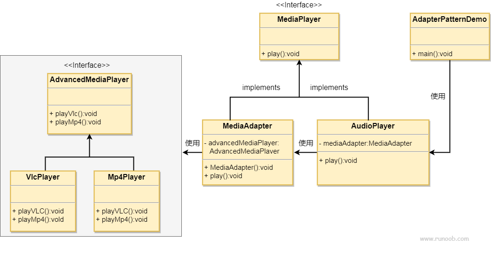

示例代码：com.pgman.goku.dp23.adapter.* 

##### 类适配器模式 

类适配器模式介绍：
基本介绍：Adapter类，通过继承 src类，实现 dst 类接口，完成src->dst的适配。

类适配器模式注意事项和细节
1) Java是单继承机制，所以类适配器需要继承src类这一点算是一个缺点, 因为这要求dst必须是接口，有一定局限性;
2) src类的方法在Adapter中都会暴露出来，也增加了使用的成本。
3) 由于其继承了src类，所以它可以根据需求重写src类的方法，使得Adapter的灵活性增强了。
   
##### 对象适配器模式 

对象适配器模式介绍
1) 基本思路和类的适配器模式相同，只是将Adapter类作修改，不是继承src类，而是持有src类的实例，以解决兼容性的问题。 即：持有 src类，实现 dst 类接口，完成src->dst的适配
2) 根据“合成复用原则”，在系统中尽量使用关联关系来替代继承关系。
3) 对象适配器模式是适配器模式常用的一种

对象适配器模式注意事项和细节
1) 对象适配器和类适配器其实算是同一种思想，只不过实现方式不同。根据合成复用原则，使用组合替代继承， 所以它解决了类适配器必须继承src的局限性问题，也不再要求dst必须是接口。
2) 使用成本更低，更灵活。

##### 接口适配器模式 

接口适配器模式介绍
1) 一些书籍称为：适配器模式(Default Adapter Pattern)或缺省适配器模式。
2) 当不需要全部实现接口提供的方法时，可先设计一个抽象类实现接口，并为该接口中每个方法提供一个默认实现（空方法），那么该抽象类的子类可有选择地覆盖父类的某些方法来实现需求
3) 适用于一个接口不想使用其所有的方法的情况。


##### 适配器模式的注意事项和细节
1) 三种命名方式，是根据 src是以怎样的形式给到Adapter（在Adapter里的形式）来命名的。
2) 类适配器：以类给到，在Adapter里，就是将src当做类，继承对象适配器：以对象给到，在Adapter里，将src作为一个对象，持有接口适配器：以接口给到，在Adapter里，将src作为一个接口，实现
3) Adapter模式最大的作用还是将原本不兼容的接口融合在一起工作。
4) 实际开发中，实现起来不拘泥于以上的三种经典形式

#### 6、桥接模式 

桥接（Bridge）是用于把抽象化与实现化解耦，使得二者可以独立变化。这种类型的设计模式属于结构型模式，它通过提供抽象化和实现化之间的桥接结构，来实现二者的解耦。

这种模式涉及到一个作为桥接的接口，使得实体类的功能独立于接口实现类。这两种类型的类可被结构化改变而互不影响。

##### 介绍
意图：将抽象部分与实现部分分离，使它们都可以独立的变化。

主要解决：在有多种可能会变化的情况下，用继承会造成类爆炸问题，扩展起来不灵活。

何时使用：实现系统可能有多个角度分类，每一种角度都可能变化。

如何解决：把这种多角度分类分离出来，让它们独立变化，减少它们之间耦合。

关键代码：抽象类依赖实现类。

应用实例： 1、猪八戒从天蓬元帅转世投胎到猪，转世投胎的机制将尘世划分为两个等级，即：灵魂和肉体，前者相当于抽象化，后者相当于实现化。生灵通过功能的委派，调用肉体对象的功能，使得生灵可以动态地选择。 2、墙上的开关，可以看到的开关是抽象的，不用管里面具体怎么实现的。

优点： 1、抽象和实现的分离。 2、优秀的扩展能力。 3、实现细节对客户透明。

缺点：桥接模式的引入会增加系统的理解与设计难度，由于聚合关联关系建立在抽象层，要求开发者针对抽象进行设计与编程。

使用场景： 

对于那些不希望使用继承或因为多层次继承导致系统类的个数急剧增加的系统，桥接模式尤为适用.

1、如果一个系统需要在构件的抽象化角色和具体化角色之间增加更多的灵活性，避免在两个层次之间建立静态的继承联系，通过桥接模式可以使它们在抽象层建立一个关联关系。 

2、对于那些不希望使用继承或因为多层次继承导致系统类的个数急剧增加的系统，桥接模式尤为适用。 

3、一个类存在两个独立变化的维度，且这两个维度都需要进行扩展。

基本介绍
1) 桥接模式(Bridge模式)是指：将实现与抽象放在两个不同的类层次中，使两个层次可以独立改变。
2) 是一种结构型设计模式
3) Bridge模式基于类的最小设计原则，通过使用封装、聚合及继承等行为让不同的类承担不同的职责。它的主要特点是把抽象(Abstraction)与行为实现(Implementation)分离开来，从而可以保持各部分的独立性以及应对他们的功能扩展
   
注意事项：对于两个独立变化的维度，使用桥接模式再适合不过了。

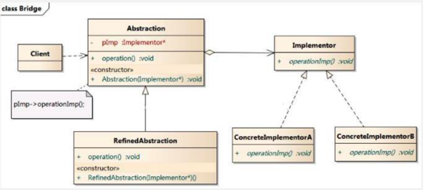

菜鸟示例：

我们有一个作为桥接实现的 DrawAPI 接口和实现了 DrawAPI 接口的实体类 RedCircle、GreenCircle。Shape 是一个抽象类，将使用 DrawAPI 的对象。BridgePatternDemo 类使用 Shape 类来画出不同颜色的圆。

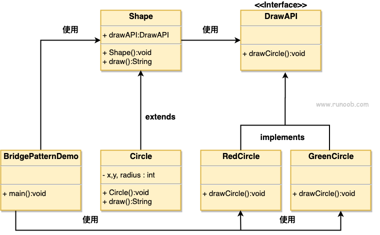

示例代码：com.pgman.goku.dp23.bridge.* 


##### 桥接模式的注意事项和细节
1) 实现了抽象和实现部分的分离，从而极大的提供了系统的灵活性，让抽象部分和实现部分独立开来，这有助于系统进行分层设计，从而产生更好的结构化系统。
2) 对于系统的高层部分，只需要知道抽象部分和实现部分的接口就可以了，其它的部分由具体业务来完成。
3) 桥接模式替代多层继承方案，可以减少子类的个数，降低系统的管理和维护成本。
4) 桥接模式的引入增加了系统的理解和设计难度，由于聚合关联关系建立在抽象层，要求开发者针对抽象进行设计和编程
5) 桥接模式要求正确识别出系统中两个独立变化的维度，因此其使用范围有一定的局限性，即需要有这样的应用场景。


#### 7、装饰器模式 

装饰器模式（Decorator Pattern）允许向一个现有的对象添加新的功能，同时又不改变其结构。这种类型的设计模式属于结构型模式，它是作为现有的类的一个包装。

这种模式创建了一个装饰类，用来包装原有的类，并在保持类方法签名完整性的前提下，提供了额外的功能。

将抽象化与实现化脱耦，使得二者可以独立的变化，也就是说将他们之间的强关联变成弱关联，也就是指在一个软件系统的抽象化和实现化之间使用组合 / 聚合关系而不是继承关系，从而使两者可以独立的变化。

动态的将新功能附加到对象上。在对象功能扩展方面，它比继承更有弹性，装饰者模式也体现了开闭原则(ocp)

##### 介绍

意图：动态地给一个对象添加一些额外的职责。就增加功能来说，装饰器模式相比生成子类更为灵活。

主要解决：一般的，我们为了扩展一个类经常使用继承方式实现，由于继承为类引入静态特征，并且随着扩展功能的增多，子类会很膨胀。

何时使用：在不想增加很多子类的情况下扩展类。

如何解决：将具体功能职责划分，同时继承装饰者模式。

关键代码： 

1、Component（主体） 类充当抽象角色，不应该具体实现。 

2、修饰类引用和继承 Component 类，具体扩展类重写父类方法。

应用实例： 

1、孙悟空有 72 变，当他变成"庙宇"后，他的根本还是一只猴子，但是他又有了庙宇的功能。 
2、不论一幅画有没有画框都可以挂在墙上，但是通常都是有画框的，并且实际上是画框被挂在墙上。在挂在墙上之前，画可以被蒙上玻璃，装到框子里；这时画、玻璃和画框形成了一个物体。

优点：装饰类和被装饰类可以独立发展，不会相互耦合，装饰模式是继承的一个替代模式，装饰模式可以动态扩展一个实现类的功能。

缺点：多层装饰比较复杂。

使用场景： 

1、扩展一个类的功能。 

2、动态增加功能，动态撤销。

注意事项：可代替继承。


菜鸟示例：

我们将创建一个 Shape 接口和实现了 Shape 接口的实体类。然后我们创建一个实现了 Shape 接口的抽象装饰类 ShapeDecorator，并把 Shape 对象作为它的实例变量。

RedShapeDecorator 是实现了 ShapeDecorator 的实体类。

DecoratorPatternDemo 类使用 RedShapeDecorator 来装饰 Shape 对象。

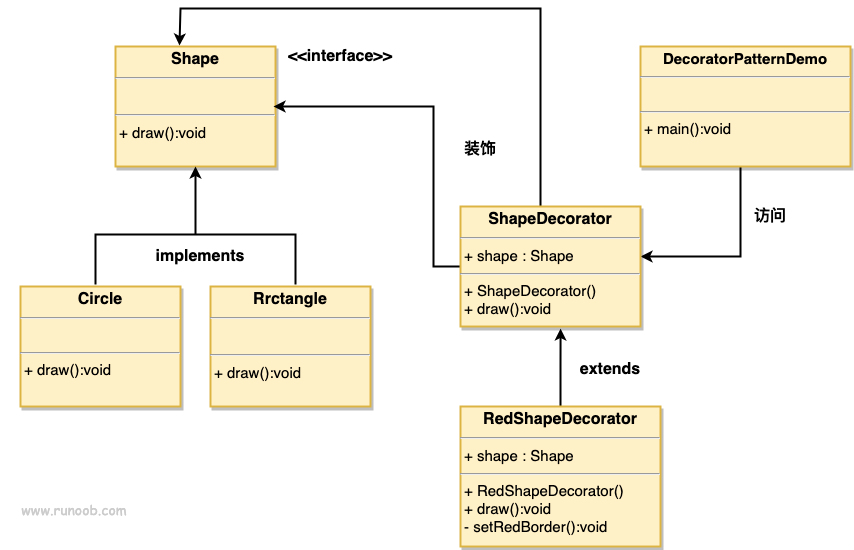

代码：com.pgman.goku.dp23.decorator.* 

#### 8、组合模式 

组合模式（Composite Pattern），又叫部分整体模式，是用于把一组相似的对象当作一个单一的对象。组合模式依据树形结构来组合对象，用来表示部分以及整体层次。这种类型的设计模式属于结构型模式，它创建了对象组的树形结构。

这种模式创建了一个包含自己对象组的类。该类提供了修改相同对象组的方式。

1) 组合模式（Composite Pattern），又叫部分整体模式，它创建了对象组的树形结构，将对象组合成树状结构以表示“整体-部分”的层次关系。
2) 组合模式依据树形结构来组合对象，用来表示部分以及整体层次。
3) 这种类型的设计模式属于结构型模式。
4) 组合模式使得用户对单个对象和组合对象的访问具有一致性，即：组合能让客户以一致的方式处理个别对象以及组合对象
   

##### 介绍 

意图：将对象组合成树形结构以表示"部分-整体"的层次结构。组合模式使得用户对单个对象和组合对象的使用具有一致性。

主要解决：它在我们树型结构的问题中，模糊了简单元素和复杂元素的概念，客户程序可以像处理简单元素一样来处理复杂元素，从而使得客户程序与复杂元素的内部结构解耦。

何时使用： 组合模式解决这样的问题，当我们的要处理的对象可以生成一颗树形结构，而我们要对树上的节点和叶子进行操作时，它能够提供一致的方式，而不用考虑它是节点还是叶子

1、您想表示对象的部分-整体层次结构（树形结构）。 

2、您希望用户忽略组合对象与单个对象的不同，用户将统一地使用组合结构中的所有对象。

如何解决：树枝和叶子实现统一接口，树枝内部组合该接口。

关键代码：树枝内部组合该接口，并且含有内部属性 List，里面放 Component。

应用实例： 1、算术表达式包括操作数、操作符和另一个操作数，其中，另一个操作符也可以是操作数、操作符和另一个操作数。 2、在 JAVA AWT 和 SWING 中，对于 Button 和 Checkbox 是树叶，Container 是树枝。

优点： 1、高层模块调用简单。 2、节点自由增加。

缺点：在使用组合模式时，其叶子和树枝的声明都是实现类，而不是接口，违反了依赖倒置原则。

使用场景：部分、整体场景，如树形菜单，文件、文件夹的管理。

注意事项：定义时为具体类。

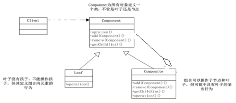

菜鸟示例：

我们有一个类 Employee，该类被当作组合模型类。CompositePatternDemo 类使用 Employee 类来添加部门层次结构，并打印所有员工。 

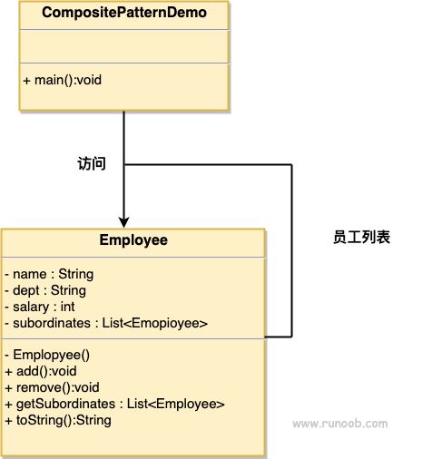

示例代码：com.pgman.goku.dp23.composite.* 

###### 组合模式的注意事项和细节

1) 简化客户端操作。客户端只需要面对一致的对象而不用考虑整体部分或者节点叶子的问题。
2) 具有较强的扩展性。当我们要更改组合对象时，我们只需要调整内部的层次关系，客户端不用做出任何改动.
3) 方便创建出复杂的层次结构。客户端不用理会组合里面的组成细节，容易添加节点或者叶子从而创建出复杂的树形结构
4) 需要遍历组织机构，或者处理的对象具有树形结构时, 非常适合使用组合模式.
5) 要求较高的抽象性，如果节点和叶子有很多差异性的话，比如很多方法和属性都不一样，不适合使用组合模式


