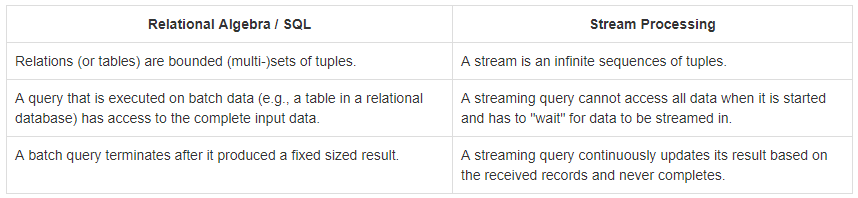
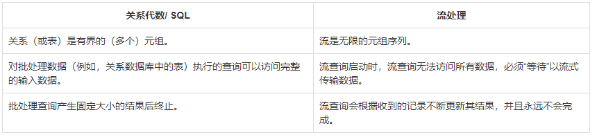
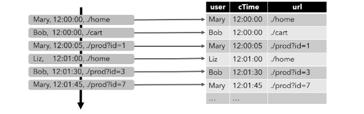
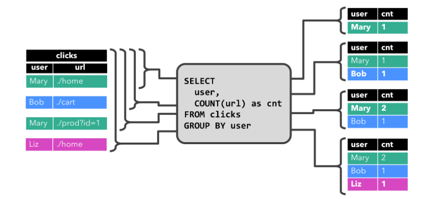
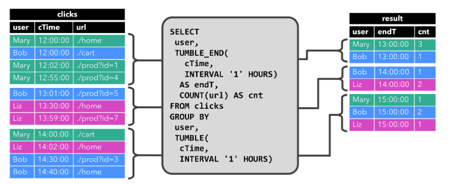
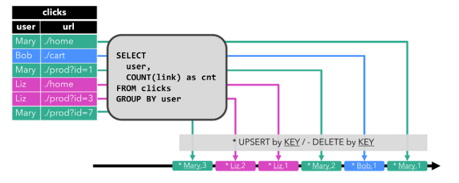

# Flink SQL 

参考资料：

Flink官方文档：https://ci.apache.org/projects/flink/flink-docs-release-1.10/zh/dev/table

Flink官方文档（中文）：https://flink-docs-cn.gitbook.io/project/05-ying-yong-kai-fa/04-table-api-and-sql/00-gai-shu

阿里云Blink文档：https://help.aliyun.com/product/45029.html?spm=a2c0j.14094430.1053885.btn4.43ea76fewfiVdj&aly_as=iUNE_Lvxs

# Flink SQL通用概念

## Main Differences Between the Two Planners

Blink treats batch jobs as a special case of streaming. As such, the conversion between Table and DataSet is also not supported, 
and batch jobs will not be translated into DateSet programs but translated into DataStream programs, the same as the streaming jobs.

Blink将批处理作业视为流的一个特例。因此，表和数据集之间的转换也不受支持，批处理作业不会被转换成DateSet程序，而是转换成DataStream程序，这与流作业相同。

The Blink planner does not support BatchTableSource, use bounded StreamTableSource instead of it.

Blink planner不支持批数据源，但是可以通过绑定流数据源替代它。

The Blink planner only support the brand new Catalog and does not support ExternalCatalog which is deprecated.

Blink计划器只支持全新的Catalog，不支持已弃用的ExternalCatalog。

The implementations of FilterableTableSource for the old planner and the Blink planner are incompatible. The old planner will push down PlannerExpressions into FilterableTableSource, 
while the Blink planner will push down Expressions.

FilterableTableSource的原有的planner 和 Blink planner是不相容的。old planner推送PlannerExpressions到FilterableTableSource，而Blink planner下推表达式。

String based key-value config options (Please see the documentation about Configuration for details) are only used for the Blink planner.

基于字符串的键值配置选项(详细信息请参阅配置文档)仅用于Blink计划程序。

The implementation(CalciteConfig) of PlannerConfig in two planners is different.

在两个计划者中PlannerConfig的实现(CalciteConfig)是不同的。

The Blink planner will optimize multiple-sinks into one DAG (supported only on TableEnvironment, not on StreamTableEnvironment). 
The old planner will always optimize each sink into a new DAG, where all DAGs are independent of each other.

Blink planner会将多个sink优化为一个DAG(只支持在TableEnvironment上，不支持在StreamTableEnvironment上)。old planner总是将每一个sink作为一个DAG处理，在那里所有的DAG是相互独立的。

The old planner does not support catalog statistics now, while the Blink planner does.

old planner现在不支持catalog统计信息，而Blink planner支持。

## Structure of Table API and SQL Programs

用于批处理和流式传输的所有Table API和SQL程序都遵循相同的模式。以下代码示例显示了Table API和SQL程序的通用结构。

```java
// create a TableEnvironment for specific planner batch or streaming
TableEnvironment tableEnv = ...; // see "Create a TableEnvironment" section

// create a Table
tableEnv.connect(...).createTemporaryTable("table1");
// register an output Table
tableEnv.connect(...).createTemporaryTable("outputTable");

// create a Table object from a Table API query
Table tapiResult = tableEnv.from("table1").select(...);
// create a Table object from a SQL query
Table sqlResult  = tableEnv.sqlQuery("SELECT ... FROM table1 ... ");

// emit a Table API result Table to a TableSink, same for SQL result
tapiResult.insertInto("outputTable");

// execute
tableEnv.execute("java_job");
```

## Create a TableEnvironment 

The TableEnvironment is a central concept of the Table API and SQL integration. It is responsible for:

TableEnvironment是table API 和 sql集成的核心概念，它通常实现如下：

Registering a Table in the internal catalog ： 在内部catalog中注册table 
Registering catalogs ： 注册catalogs 
Loading pluggable modules ： 加载可插拔模块插件 
Executing SQL queries ： 执行sql查询 
Registering a user-defined (scalar, table, or aggregation) function ： 注册udf 
Converting a DataStream or DataSet into a Table ： 将datastream和dataset转化为table 
Holding a reference to an ExecutionEnvironment or StreamExecutionEnvironment ：保存对执行环境或StreamExecutionEnvironment的引用


A Table is always bound to a specific TableEnvironment. It is not possible to combine tables of different TableEnvironments in the same query, e.g., to join or union them.

一个table总是绑定到一个TableEnvironment，不可能在同一查询中组合不同TableEnvironments的表，例如，join或union。

A TableEnvironment is created by calling the static BatchTableEnvironment.create() or StreamTableEnvironment.create() method with a StreamExecutionEnvironment or an ExecutionEnvironment 
and an optional TableConfig. The TableConfig can be used to configure the TableEnvironment or to customize the query optimization and translation process (see Query Optimization).

TableEnvironment 由 BatchTableEnvironment.create() 或 StreamTableEnvironment.create()静态方法创建，包含一个 StreamExecutionEnvironment 或者 ExecutionEnvironment 和一个可选的TableConfig。TableConfig可以被用来定义一些TableEnvironment的配置信息。

Make sure to choose the specific planner BatchTableEnvironment/StreamTableEnvironment that matches your programming language.

明确选择和你的程序场景匹配的BatchTableEnvironment/StreamTableEnvironment环境。

If both planner jars are on the classpath (the default behavior), you should explicitly set which planner to use in the current program. 
If there is only one planner jar in /lib directory, you can use useAnyPlanner (use_any_planner for python) to create specific EnvironmentSettings.

如果两个planner jar都在类路径上(默认行为)，您应该显式地设置在当前程序中使用哪个planner。如果只有一个jar在classpath中，你可以使用useAnyPlanner（可以动态识别流或批环境）创建一个执行环境。

示例：
com.pgman.goku.table.CreateTableEnvironment

## Create Tables in the Catalog 

A TableEnvironment maintains a map of catalogs of tables which are created with an identifier. Each identifier consists of 3 parts: catalog name, database name and object name. 
If a catalog or database is not specified, the current default value will be used (see examples in the Table identifier expanding section).

A TableEnvironment维护使用标识符创建的表目录的映射。每个标识符由3部分组成：catalog name, database name 和 object name。如果未指定目录或数据库，则将使用当前默认值（请参阅表标识符扩展部分中的示例）。

Tables can be either virtual (VIEWS) or regular (TABLES). VIEWS can be created from an existing Table object, usually the result of a Table API or SQL query. 
TABLES describe external data, such as a file, database table, or message queue.

表可以是虚拟（VIEWS）或常规（TABLES）。VIEWS可以从现有Table对象创建，通常是Table API或SQL查询的结果。TABLES描述外部数据，例如文件，数据库表或消息队列。

### Temporary vs Permanent tables 

Tables may either be temporary, and tied to the lifecycle of a single Flink session, or permanent, and visible across multiple Flink sessions and clusters.

表可以是临时的，并与单个Flink会话的生命周期相关，也可以是永久的，并且在多个Flink会话和群集中可见。

Permanent tables require a catalog (such as Hive Metastore) to maintain metadata about the table. Once a permanent table is created, 
it is visible to any Flink session that is connected to the catalog and will continue to exist until the table is explicitly dropped.

永久表需要一个catalog（例如Hive Metastore）来维护有关表的元数据。创建永久表后，连接到catalog的任何Flink会话都可以看到该表，并且该表将继续存在，直到明确删除该表为止。

On the other hand, temporary tables are always stored in memory and only exist for the duration of the Flink session they are created within. 
These tables are not visible to other sessions. They are not bound to any catalog or database but can be created in the namespace of one. 
Temporary tables are not dropped if their corresponding database is removed.

另一方面，临时表始终存储在内存中，并且仅在创建它们的Flink会话期间存在。这些表对其他会话不可见。它们未绑定到任何目录或数据库，但可以在一个目录或数据库的名称空间中创建。如果删除了临时表的相应数据库，则不会删除这些临时表。

Shadowing（重影：指与永久表重名的临时表和永久表）

It is possible to register a temporary table with the same identifier as an existing permanent table. 
The temporary table shadows the permanent one and makes the permanent table inaccessible as long as the temporary one exists. 
All queries with that identifier will be executed against the temporary table.

可以使用与现有永久表相同的标识符注册一个临时表。只要存在临时表，该临时表就会覆盖该永久表，并使该永久表不可访问。具有该标识符的所有查询将针对临时表执行。


This might be useful for experimentation. It allows running exactly the same query first against a temporary table that e.g. has just a subset of data, 
or the data is obfuscated. Once verified that the query is correct it can be run against the real production table.

这可能对实验有用。它允许首先对临时表运行完全相同的查询，该临时表例如仅具有数据的一个子集，或者对数据进行混淆。一旦验证查询正确无误，就可以针对实际生产表运行查询。

### Create a Table 

#### Virtual Tables 

A Table API object corresponds to a VIEW (virtual table) in a SQL terms. It encapsulates a logical query plan. It can be created in a catalog as follows: 

Table API对象对应于VIEW（虚拟表）是一个SQL术语。它封装了逻辑查询计划。可以在目录中创建它，如下所示：

```java
// get a TableEnvironment
TableEnvironment tableEnv = ...; // see "Create a TableEnvironment" section

// table is the result of a simple projection query 
Table projTable = tableEnv.from("X").select(...);

// register the Table projTable as table "projectedTable"
tableEnv.createTemporaryView("projectedTable", projTable);
```

#### Connector Tables 

It is also possible to create a TABLE as known from relational databases from a connector declaration. The connector describes the external system that stores the data of a table. 
Storage systems such as Apacha Kafka or a regular file system can be declared here.

也可以通过connerctor声明从一个关系数据库中创建一张TABLE 。连接器描述了存储表数据的外部系统。存储系统可以如Apacha Kafka之类的存储系统或常规文件系统。

```java
tableEnvironment
  .connect(...)
  .withFormat(...)
  .withSchema(...)
  .inAppendMode()
  .createTemporaryTable("MyTable")
```

### Expanding Table identifiers 

Tables are always registered with a 3-part identifier consisting of catalog, database, and table name.

表始终由目录，数据库和表名组成的三部分标识符注册。

Users can set one catalog and one database inside it to be the “current catalog” and “current database”. With them, 
the first two parts in the 3-parts identifier mentioned above can be optional - if they are not provided, 
the current catalog and current database will be referred. Users can switch the current catalog and current database via table API or SQL.

用户可以将一个目录和其中的一个数据库设置为“当前目录”和“当前数据库”。使用它们，上述三部分标识符中的前两个部分可以是可选的-如果未提供它们，则将引用当前目录和当前数据库。用户可以通过表API或SQL切换当前目录和当前数据库。

Identifiers follow SQL requirements which means that they can be escaped with a backtick character (`). Additionally all SQL reserved keywords must be escaped.

标识符遵循SQL要求，这意味着可以使用反引号（`）对其进行转义。此外，所有SQL保留关键字都必须转义。

```java
TableEnvironment tEnv = ...;
tEnv.useCatalog("custom_catalog");
tEnv.useDatabase("custom_database");

Table table = ...;

// register the view named 'exampleView' in the catalog named 'custom_catalog'
// in the database named 'custom_database' 
tableEnv.createTemporaryView("exampleView", table);

// register the view named 'exampleView' in the catalog named 'custom_catalog'
// in the database named 'other_database' 
tableEnv.createTemporaryView("other_database.exampleView", table);

// register the view named 'View' in the catalog named 'custom_catalog' in the
// database named 'custom_database'. 'View' is a reserved keyword and must be escaped.  
tableEnv.createTemporaryView("`View`", table);

// register the view named 'example.View' in the catalog named 'custom_catalog'
// in the database named 'custom_database' 
tableEnv.createTemporaryView("`example.View`", table);

// register the view named 'exampleView' in the catalog named 'other_catalog'
// in the database named 'other_database' 
tableEnv.createTemporaryView("other_catalog.other_database.exampleView", table);
```

## Query a Table

### Table API

The Table API is a language-integrated query API for Scala and Java. In contrast to SQL, queries are not specified as Strings but are composed step-by-step in the host language.

Table API是用于Scala和Java的语言集成查询API。与SQL相比，查询未指定为字符串，而是以宿主语言逐步构成。

The API is based on the Table class which represents a table (streaming or batch) and offers methods to apply relational operations. 
These methods return a new Table object, which represents the result of applying the relational operation on the input Table. 
Some relational operations are composed of multiple method calls such as table.groupBy(...).select(), where groupBy(...) specifies a grouping of table, 
and select(...) the projection on the grouping of table.

API基于Table代表表（流或批处理）的类，并提供应用关系操作的方法。这些方法返回一个新Table对象，该对象表示在input上应用关系运算的结果Table。
一些关系操作由多个方法调用组成，例如table.groupBy(...).select()，其中groupBy(...)指定的分组table和select(...)对分组的投影table。

The Table API document describes all Table API operations that are supported on streaming and batch tables.

Table API文档介绍了支持流批的所有表API操作。

The following example shows a simple Table API aggregation query:

以下示例显示了一个简单的Table API聚合查询：

```java
// get a TableEnvironment
TableEnvironment tableEnv = ...; // see "Create a TableEnvironment" section

// register Orders table

// scan registered Orders table
Table orders = tableEnv.from("Orders");
// compute revenue for all customers from France
Table revenue = orders
  .filter("cCountry === 'FRANCE'")
  .groupBy("cID, cName")
  .select("cID, cName, revenue.sum AS revSum");

// emit or convert Table
// execute query
```

### SQL 

Flink’s SQL integration is based on Apache Calcite, which implements the SQL standard. SQL queries are specified as regular Strings.

Flink的SQL集成基于Apache Calcite，后者实现了SQL标准。SQL查询被指定为常规字符串。

The SQL document describes Flink’s SQL support for streaming and batch tables.

SQL文件描述flink的流表和批表的SQL支持。

The following example shows how to specify a query and return the result as a Table.

以下示例说明如何指定查询并以返回结果Table。

```java
// get a TableEnvironment
TableEnvironment tableEnv = ...; // see "Create a TableEnvironment" section

// register Orders table

// compute revenue for all customers from France
Table revenue = tableEnv.sqlQuery(
    "SELECT cID, cName, SUM(revenue) AS revSum " +
    "FROM Orders " +
    "WHERE cCountry = 'FRANCE' " +
    "GROUP BY cID, cName"
  );

// emit or convert Table
// execute query
```

The following example shows how to specify an update query that inserts its result into a registered table. 

```java
// get a TableEnvironment
TableEnvironment tableEnv = ...; // see "Create a TableEnvironment" section

// register "Orders" table
// register "RevenueFrance" output table

// compute revenue for all customers from France and emit to "RevenueFrance"
tableEnv.sqlUpdate(
    "INSERT INTO RevenueFrance " +
    "SELECT cID, cName, SUM(revenue) AS revSum " +
    "FROM Orders " +
    "WHERE cCountry = 'FRANCE' " +
    "GROUP BY cID, cName"
  );

// execute query
```

### Mixing Table API and SQL 

Table API and SQL queries can be easily mixed because both return Table objects:

表API和SQL查询可以轻松混合，因为它们都返回Table对象：

A Table API query can be defined on the Table object returned by a SQL query.
A SQL query can be defined on the result of a Table API query by registering the resulting Table in the TableEnvironment and referencing it in the FROM clause of the SQL query.

可以在TableSQL查询返回的对象上定义Table API 查询。
可以通过在Table API查询的结果上定义SQL查询，方法是在TableAPI中注册结果表，TableEnvironment然后在FROM SQL子句中引用该表。

## Emit a Table 

A Table is emitted by writing it to a TableSink. A TableSink is a generic interface to support a wide variety of file formats (e.g. CSV, Apache Parquet, Apache Avro), 
storage systems (e.g., JDBC, Apache HBase, Apache Cassandra, Elasticsearch), or messaging systems (e.g., Apache Kafka, RabbitMQ).

一个Table通过写入TableSink。A TableSink是通用接口，支持多种文件格式（例如CSV，Apache Parquet，Apache Avro），
存储系统（例如JDBC，Apache HBase，Apache Cassandra，Elasticsearch）或消息队列（例如Apache Kafka，RabbitMQ））。


A batch Table can only be written to a BatchTableSink, while a streaming Table requires either an AppendStreamTableSink, a RetractStreamTableSink, or an UpsertStreamTableSink.

一batch Table只能写入BatchTableSink，而 streaming Table需要AppendStreamTableSink，一个RetractStreamTableSink，或一个UpsertStreamTableSink中的一种。

Please see the documentation about Table Sources & Sinks for details about available sinks and instructions for how to implement a custom TableSink.

请参阅有关Table Sources & Sinks的文档，以获取有关可用接收器的详细信息以及如何实现自定义的说明TableSink。

The Table.insertInto(String tableName) method emits the Table to a registered TableSink. The method looks up the TableSink from the catalog by the name 
and validates that the schema of the Table is identical to the schema of the TableSink.

该Table.insertInto(String tableName)方法将发出Table给已注册TableSink。该方法TableSink通过名称从catalog中查找，并验证的架构Table与的架构相同TableSink。

The following examples shows how to emit a Table:

以下示例显示了如何发出Table： 

```java
// get a TableEnvironment
TableEnvironment tableEnv = ...; // see "Create a TableEnvironment" section

// create an output Table
final Schema schema = new Schema()
    .field("a", DataTypes.INT())
    .field("b", DataTypes.STRING())
    .field("c", DataTypes.LONG());

tableEnv.connect(new FileSystem("/path/to/file"))
    .withFormat(new Csv().fieldDelimiter('|').deriveSchema())
    .withSchema(schema)
    .createTemporaryTable("CsvSinkTable");

// compute a result Table using Table API operators and/or SQL queries
Table result = ...
// emit the result Table to the registered TableSink
result.insertInto("CsvSinkTable");

// execute the program
```

## Translate and Execute a Query 

The behavior of translating and executing a query is different for the two planners.
对于两个计划者来说，翻译和执行查询的行为是不同的。

### Old planner 

Table API and SQL queries are translated into DataStream or DataSet programs depending on whether their input is a streaming or batch input. 
A query is internally represented as a logical query plan and is translated in two phases:

Optimization of the logical plan
Translation into a DataStream or DataSet program

根据表API和SQL查询依赖他们的输入stream数据源或者batch数据源被翻译为datastream和dataset程序执行。查询在内部表示为逻辑查询计划，并分为两个阶段：

优化逻辑计划
转换为DataStream或DataSet程序


A Table API or SQL query is translated when:

a Table is emitted to a TableSink, i.e., when Table.insertInto() is called.
a SQL update query is specified, i.e., when TableEnvironment.sqlUpdate() is called.
a Table is converted into a DataStream or DataSet (see Integration with DataStream and DataSet API).

在以下情况下，将转换Table API或SQL查询：

Table发送到TableSink，即Table.insertInto()被调用时。
指定了SQL更新查询，即TableEnvironment.sqlUpdate()被调用。
将Table被转换为DataStream或DataSet（请参阅与DataStream和DataSet API集成）。

Once translated, a Table API or SQL query is handled like a regular DataStream or DataSet program and is executed when StreamExecutionEnvironment.execute() 
or ExecutionEnvironment.execute() is called.

转换后，将像常规DataStream或DataSet程序一样处理Table API或SQL查询，并在调用StreamExecutionEnvironment.execute() 或 ExecutionEnvironment.execute() 时被执行。

### Blink planner 

Table API and SQL queries are translated into DataStream programs whether their input is streaming or batch. A query is internally represented as a logical query plan and is 
translated in two phases:

Optimization of the logical plan,
Translation into a DataStream program.

根据表API和SQL查询依赖他们的输入stream数据源或者batch数据源被翻译为datastream和dataset程序执行。查询在内部表示为逻辑查询计划，并分为两个阶段：

优化逻辑计划，
转换为DataStream程序。

The behavior of translating a query is different for TableEnvironment and StreamTableEnvironment.

TableEnvironment和StreamTableEnvironment的转换行为是不同的。

For TableEnvironment, a Table API or SQL query is translated when TableEnvironment.execute() is called, because TableEnvironment will optimize multiple-sinks into one DAG.

对于TableEnvironment，当TableEnvironment.execute()被调用，表API或SQL查询被转换，因为TableEnvironment它将把多个接收器优化为一个DAG。

While for StreamTableEnvironment, a Table API or SQL query is translated when:

a Table is emitted to a TableSink, i.e., when Table.insertInto() is called.
a SQL update query is specified, i.e., when TableEnvironment.sqlUpdate() is called.
a Table is converted into a DataStream.

对于StreamTableEnvironment，在以下情况下会转换Table API或SQL查询：

当Table发送到TableSink，即Table.insertInto()被调用时。
指定了SQL更新查询，即TableEnvironment.sqlUpdate()被调用。
将Table转换为DataStream。

Once translated, a Table API or SQL query is handled like a regular DataStream program and is executed when TableEnvironment.execute() or StreamExecutionEnvironment.execute() is called.

转换后，将像常规DataStream程序一样处理Table API或SQL查询，并在调用StreamExecutionEnvironment.execute() 或 ExecutionEnvironment.execute() 时被执行。


## Integration with DataStream and DataSet API 

Both planners on stream can integrate with the DataStream API. Only old planner can integrate with the DataSet API, Blink planner on batch could not be combined with both. 
Note: The DataSet API discussed below is only relevant for the old planner on batch.

计划中的两个计划者都可以与DataStreamAPI 集成。只有old planner程序可以DataSet API与集成，Blink planner程序在batch上不能与两者结合使用。 注意：以下DataSet讨论的API仅与batch使用的old planner程序有关。

Table API and SQL queries can be easily integrated with and embedded into DataStream and DataSet programs. For instance, 
it is possible to query an external table (for example from a RDBMS), do some pre-processing, such as filtering, projecting, aggregating, 
or joining with meta data, and then further process the data with either the DataStream or DataSet API (and any of the libraries built on top of these APIs, such as CEP or Gelly). 
Inversely, a Table API or SQL query can also be applied on the result of a DataStream or DataSet program.

表API和SQL查询可以轻松地与DataStream和DataSet程序集成并嵌入其中。例如，可以查询外部表（例如从RDBMS），进行一些预处理，例如filtering, projecting, aggregating或者joining，
然后进一步使用DataStream或DataSet API处理（以及在这些API之上构建的任何库，例如CEP或Gelly）。相反，也可以将Table API或SQL查询应用于DataStream或DataSet程序的结果。

This interaction can be achieved by converting a DataStream or DataSet into a Table and vice versa. In this section, we describe how these conversions are done.

可以通过将DataStream或DataSeta转换为Table，反之亦然来实现此交互。在本节中，我们描述如何完成这些转换。

### Implicit Conversion for Scala
The Scala Table API features implicit conversions for the DataSet, DataStream, and Table classes. These conversions are enabled by importing the package org.apache.flink.table.api.scala._ in addition to org.apache.flink.api.scala._ for the Scala DataStream API.

### Create a View from a DataStream or DataSet 

A DataStream or DataSet can be registered in a TableEnvironment as a View. The schema of the resulting view depends on the data type of the registered DataStream or DataSet. 
Please check the section about mapping of data types to table schema for details.

一个DataStream或DataSet可在被注册作为一个view通过TableEnvironment。结果视图的schema取决于已注册DataStream或DataSet的数据类型。请检查有关将数据类型映射到表模式的部分，以获取详细信息。

Note: Views created from a DataStream or DataSet can be registered as temporary views only.

注意：从DataStream或DataSet创建的视图只能注册为临时视图。

```java
// get StreamTableEnvironment
// registration of a DataSet in a BatchTableEnvironment is equivalent
StreamTableEnvironment tableEnv = ...; // see "Create a TableEnvironment" section

DataStream<Tuple2<Long, String>> stream = ...

// register the DataStream as View "myTable" with fields "f0", "f1"
tableEnv.createTemporaryView("myTable", stream);

// register the DataStream as View "myTable2" with fields "myLong", "myString"
tableEnv.createTemporaryView("myTable2", stream, "myLong, myString");
```

### Convert a DataStream or DataSet into a Table 

Instead of registering a DataStream or DataSet in a TableEnvironment, it can also be directly converted into a Table. 
This is convenient if you want to use the Table in a Table API query.

除了注册DataStream或DataSet之外在TableEnvironment，还可以将其直接转换为Table。如果要在Table API查询中使用Table，这将很方便。

```java
// get StreamTableEnvironment
// registration of a DataSet in a BatchTableEnvironment is equivalent
StreamTableEnvironment tableEnv = ...; // see "Create a TableEnvironment" section

DataStream<Tuple2<Long, String>> stream = ...

// Convert the DataStream into a Table with default fields "f0", "f1"
Table table1 = tableEnv.fromDataStream(stream);

// Convert the DataStream into a Table with fields "myLong", "myString"
Table table2 = tableEnv.fromDataStream(stream, "myLong, myString");
```

### Convert a Table into a DataStream or DataSet 

A Table can be converted into a DataStream or DataSet. In this way, custom DataStream or DataSet programs can be run on the result of a Table API or SQL query.

Table可以转换为DataStream或DataSet。这样，可以在Table API或SQL查询的结果上运行自定义DataStream或DataSet程序。

When converting a Table into a DataStream or DataSet, you need to specify the data type of the resulting DataStream or DataSet, i.e., 
the data type into which the rows of the Table are to be converted. Often the most convenient conversion type is Row. 
The following list gives an overview of the features of the different options:

将Table转换为DataStream或DataSet，您需要指定DataStream或DataSet的数据类型，即，Table的每一行需要转换数据类型。最方便的转换类型通常是Row。以下列表概述了不同选项的功能：

Row: fields are mapped by position, arbitrary number of fields, support for null values, no type-safe access.

字段按位置映射，任意数量的字段，对null值的支持，无类型安全的访问。

POJO: fields are mapped by name (POJO fields must be named as Table fields), arbitrary number of fields, support for null values, type-safe access.

字段按名称映射（POJO字段必须命名为Table字段），任意数量的字段，支持null值，类型安全访问。

Case Class: fields are mapped by position, no support for null values, type-safe access.

字段按位置映射，不支持null值，类型安全访问。

Tuple: fields are mapped by position, limitation to 22 (Scala) or 25 (Java) fields, no support for null values, type-safe access.

字段按位置映射，限制为22（Scala）或25（Java）字段，不支持null值，类型安全访问。

Atomic Type: Table must have a single field, no support for null values, type-safe access.

Table必须具有单个字段，不支持null值，类型安全访问。


#### Convert a Table into a DataStream

A Table that is the result of a streaming query will be updated dynamically, i.e., it is changing as new records arrive on the query’s input streams. 
Hence, the DataStream into which such a dynamic query is converted needs to encode the updates of the table.

Table结果支持动态更新的流查询，即，随着新记录到达查询的输入流，它会发生变化。因此，将DataStream这种动态查询转换成的内容需要对表的更新进行编码。

There are two modes to convert a Table into a DataStream:

Append Mode: This mode can only be used if the dynamic Table is only modified by INSERT changes, i.e, it is append-only and previously emitted results are never updated.
Retract Mode: This mode can always be used. It encodes INSERT and DELETE changes with a boolean flag.

有两种模式将Table转换为DataStream：

Append Mode：仅在动态Table仅通过INSERT更改进行修改的情况下才能使用此模式，即仅追加并且以前发出的结果从不更新。
Retract Mode：始终可以使用此模式。它在INSERT和DELETE更改时通过boolean进行编码。

```java
// get StreamTableEnvironment. 
StreamTableEnvironment tableEnv = ...; // see "Create a TableEnvironment" section

// Table with two fields (String name, Integer age)
Table table = ...

// convert the Table into an append DataStream of Row by specifying the class
DataStream<Row> dsRow = tableEnv.toAppendStream(table, Row.class);

// convert the Table into an append DataStream of Tuple2<String, Integer> 
//   via a TypeInformation
TupleTypeInfo<Tuple2<String, Integer>> tupleType = new TupleTypeInfo<>(
  Types.STRING(),
  Types.INT());

DataStream<Tuple2<String, Integer>> dsTuple = 
  tableEnv.toAppendStream(table, tupleType);

// convert the Table into a retract DataStream of Row.
//   A retract stream of type X is a DataStream<Tuple2<Boolean, X>>. 
//   The boolean field indicates the type of the change. 
//   True is INSERT, false is DELETE.
DataStream<Tuple2<Boolean, Row>> retractStream = 
  tableEnv.toRetractStream(table, Row.class);
```

#### Convert a Table into a DataSet
A Table is converted into a DataSet as follows:

table可以转换为dataset，如下：

```java
// get BatchTableEnvironment
BatchTableEnvironment tableEnv = BatchTableEnvironment.create(env);

// Table with two fields (String name, Integer age)
Table table = ...

// convert the Table into a DataSet of Row by specifying a class
DataSet<Row> dsRow = tableEnv.toDataSet(table, Row.class);

// convert the Table into a DataSet of Tuple2<String, Integer> via a TypeInformation
TupleTypeInfo<Tuple2<String, Integer>> tupleType = new TupleTypeInfo<>(
  Types.STRING(),
  Types.INT());

DataSet<Tuple2<String, Integer>> dsTuple = tableEnv.toDataSet(table, tupleType);
```

### Mapping of Data Types to Table Schema 

Flink’s DataStream and DataSet APIs support very diverse types. Composite types such as Tuples (built-in Scala and Flink Java tuples), POJOs, 
Scala case classes, and Flink’s Row type allow for nested data structures with multiple fields that can be accessed in table expressions. 
Other types are treated as atomic types. In the following, we describe how the Table API converts these types into an internal row representation and show examples of converting a DataStream into a Table.

Flink的DataStream和DataSet API支持非常多种类型。元组（内置Scala和Flink Java元组），POJO，Scala case class和Flink的Row类型等 允许嵌套的具有多个字段复合类型数据结构，这些字段可在表表达式中访问。其他类型被视为原子类型。
下面，我们描述Table API如何将这些类型转换为内部行表示形式，并显示将DataStream转换为Table。

The mapping of a data type to a table schema can happen in two ways: based on the field positions or based on the field names.

数据类型到表模式的映射可以两种方式发生：基于字段位置或基于字段名称。

#### Position-based Mapping（基于位置的映射）

Position-based mapping can be used to give fields a more meaningful name while keeping the field order. This mapping is available for composite data types with a defined field order as well as atomic types. 
Composite data types such as tuples, rows, and case classes have such a field order. However, fields of a POJO must be mapped based on the field names (see next section). 
Fields can be projected out but can’t be renamed using an alias as.

基于位置的映射可用于在保持字段顺序的同时为字段赋予更有意义的名称。此映射可用于具有定义的字段顺序的复合数据类型以及原子类型。tuple,rows,case classes等复合数据类型具有这样的字段顺序。
但是，POJO类型必须根据字段名称映射（请参阅下一节）。字段可以投影出来，但不能用as重命名。

When defining a position-based mapping, the specified names must not exist in the input data type, otherwise the API will assume that the mapping should happen based on the field names. 
If no field names are specified, the default field names and field order of the composite type are used or f0 for atomic types.

在定义基于位置的映射时，输入数据类型中不得存在指定的名称，否则API会假定映射应基于字段名称进行。如果未指定任何字段名，则使用默认类型的字段名和复合类型的字段顺序或f0原子类型。

```java
// get a StreamTableEnvironment, works for BatchTableEnvironment equivalently
StreamTableEnvironment tableEnv = ...; // see "Create a TableEnvironment" section;

DataStream<Tuple2<Long, Integer>> stream = ...

// convert DataStream into Table with default field names "f0" and "f1"
Table table = tableEnv.fromDataStream(stream);

// convert DataStream into Table with field "myLong" only
Table table = tableEnv.fromDataStream(stream, "myLong");

// convert DataStream into Table with field names "myLong" and "myInt"
Table table = tableEnv.fromDataStream(stream, "myLong, myInt");
```

#### Name-based Mapping(基于名称的映射)

Name-based mapping can be used for any data type including POJOs. It is the most flexible way of defining a table schema mapping.
 All fields in the mapping are referenced by name and can be possibly renamed using an alias as. Fields can be reordered and projected out.

基于名称的映射可用于任何数据类型，包括POJO。这是定义表模式映射的最灵活的方法。映射中的所有字段均按名称引用，并且可以使用as重命名。字段可以重新排序和投影。

If no field names are specified, the default field names and field order of the composite type are used or f0 for atomic types.

如果未指定任何字段名，则使用默认类型的字段名和复合类型的字段顺序或f0原子类型。

```java
// get a StreamTableEnvironment, works for BatchTableEnvironment equivalently
StreamTableEnvironment tableEnv = ...; // see "Create a TableEnvironment" section

DataStream<Tuple2<Long, Integer>> stream = ...

// convert DataStream into Table with default field names "f0" and "f1"
Table table = tableEnv.fromDataStream(stream);

// convert DataStream into Table with field "f1" only
Table table = tableEnv.fromDataStream(stream, "f1");

// convert DataStream into Table with swapped fields
Table table = tableEnv.fromDataStream(stream, "f1, f0");

// convert DataStream into Table with swapped fields and field names "myInt" and "myLong"
Table table = tableEnv.fromDataStream(stream, "f1 as myInt, f0 as myLong");
```

#### Atomic Types

Flink treats primitives (Integer, Double, String) or generic types (types that cannot be analyzed and decomposed) as atomic types. 
A DataStream or DataSet of an atomic type is converted into a Table with a single attribute. The type of the attribute is inferred from the atomic type and the name of the attribute can be specified.

Flink将基本数据类型（Integer，Double，String）或通用类型作为原子类型（无法进行分析和分解类型）。一个DataStream或DataSet将table的一个属性映射为一个原子类型。从原子类型推断出属性的类型，并且可以指定属性的名称。

```java
// get a StreamTableEnvironment, works for BatchTableEnvironment equivalently
StreamTableEnvironment tableEnv = ...; // see "Create a TableEnvironment" section

DataStream<Long> stream = ...

// convert DataStream into Table with default field name "f0"
Table table = tableEnv.fromDataStream(stream);

// convert DataStream into Table with field name "myLong"
Table table = tableEnv.fromDataStream(stream, "myLong");
```

#### Tuples (Scala and Java) and Case Classes (Scala only)

Flink supports Scala’s built-in tuples and provides its own tuple classes for Java. DataStreams and DataSets of both kinds of tuples can be converted into tables. 
Fields can be renamed by providing names for all fields (mapping based on position). If no field names are specified, the default field names are used. If the original field names 
(f0, f1, … for Flink Tuples and _1, _2, … for Scala Tuples) are referenced, the API assumes that the mapping is name-based instead of position-based. 
Name-based mapping allows for reordering fields and projection with alias (as).

Flink支持Scala的内置元组，并为Java提供了自己的元组类。两种元组的DataStreams和DataSet都可以转换为表。可以通过提供所有字段的名称来重命名字段（根据位置进行映射）。
如果未指定任何字段名称，则使用默认字段名称。如果原始字段名（f0, f1, … for Flink Tuples and _1, _2, … for Scala Tuples）被引用时，API假设基于名称而不是基于位置的映射。基于名称的映射允许使用别名（as）对字段和投影进行重新排序。

```java
// get a StreamTableEnvironment, works for BatchTableEnvironment equivalently
StreamTableEnvironment tableEnv = ...; // see "Create a TableEnvironment" section

DataStream<Tuple2<Long, String>> stream = ...

// convert DataStream into Table with default field names "f0", "f1"
Table table = tableEnv.fromDataStream(stream);

// convert DataStream into Table with renamed field names "myLong", "myString" (position-based)
Table table = tableEnv.fromDataStream(stream, "myLong, myString");

// convert DataStream into Table with reordered fields "f1", "f0" (name-based)
Table table = tableEnv.fromDataStream(stream, "f1, f0");

// convert DataStream into Table with projected field "f1" (name-based)
Table table = tableEnv.fromDataStream(stream, "f1");

// convert DataStream into Table with reordered and aliased fields "myString", "myLong" (name-based)
Table table = tableEnv.fromDataStream(stream, "f1 as 'myString', f0 as 'myLong'");
```

#### POJO (Java and Scala)
Flink supports POJOs as composite types. The rules for what determines a POJO are documented here.

Flink支持POJO作为复合类型。确定POJO的规则在此处记录。

When converting a POJO DataStream or DataSet into a Table without specifying field names, the names of the original POJO fields are used. 
The name mapping requires the original names and cannot be done by positions. Fields can be renamed using an alias (with the as keyword), reordered, and projected.

当使用POJO将DataStream或DataSet成Table并且没有指定字段名，则使用原始POJO字段的名称。名称映射需要原始名称，并且不能按位置进行映射。字段可以使用别名（带有as关键字）重命名，重新排序和投影。

```java
// get a StreamTableEnvironment, works for BatchTableEnvironment equivalently
StreamTableEnvironment tableEnv = ...; // see "Create a TableEnvironment" section

// Person is a POJO with fields "name" and "age"
DataStream<Person> stream = ...

// convert DataStream into Table with default field names "age", "name" (fields are ordered by name!)
Table table = tableEnv.fromDataStream(stream);

// convert DataStream into Table with renamed fields "myAge", "myName" (name-based)
Table table = tableEnv.fromDataStream(stream, "age as myAge, name as myName");

// convert DataStream into Table with projected field "name" (name-based)
Table table = tableEnv.fromDataStream(stream, "name");

// convert DataStream into Table with projected and renamed field "myName" (name-based)
Table table = tableEnv.fromDataStream(stream, "name as myName");
```

#### Row

The Row data type supports an arbitrary number of fields and fields with null values. Field names can be specified via a RowTypeInfo or when converting a Row DataStream or DataSet into a Table. 
The row type supports mapping of fields by position and by name. Fields can be renamed by providing names for all fields (mapping based on position) or selected individually 
for projection/ordering/renaming (mapping based on name).

Row数据类型支持任意数量字段并且支持null值。字段名称可以通过指定RowTypeInfo或转化Row类型的 DataStream或DataSet成Table。row类型支持按位置和名称映射字段。
可以通过提供所有字段的名称（基于位置的映射）来重命名字段，也可以为投影/排序/重新命名（基于名称的映射）单独选择字段。

```java
// get a StreamTableEnvironment, works for BatchTableEnvironment equivalently
StreamTableEnvironment tableEnv = ...; // see "Create a TableEnvironment" section

// DataStream of Row with two fields "name" and "age" specified in `RowTypeInfo`
DataStream<Row> stream = ...

// convert DataStream into Table with default field names "name", "age"
Table table = tableEnv.fromDataStream(stream);

// convert DataStream into Table with renamed field names "myName", "myAge" (position-based)
Table table = tableEnv.fromDataStream(stream, "myName, myAge");

// convert DataStream into Table with renamed fields "myName", "myAge" (name-based)
Table table = tableEnv.fromDataStream(stream, "name as myName, age as myAge");

// convert DataStream into Table with projected field "name" (name-based)
Table table = tableEnv.fromDataStream(stream, "name");

// convert DataStream into Table with projected and renamed field "myName" (name-based)
Table table = tableEnv.fromDataStream(stream, "name as myName");
```

## Query Optimization

### old planner 

Apache Flink leverages Apache Calcite to optimize and translate queries. The optimization currently performed include projection and filter push-down, subquery decorrelation, 
and other kinds of query rewriting. Old planner does not yet optimize the order of joins, but executes them in the same order as defined in the query 
(order of Tables in the FROM clause and/or order of join predicates in the WHERE clause).

Apache Flink利用Apache Calcite来优化和翻译查询。当前执行的优化包括投影和过滤器下推，子查询去相关以及其他类型的查询重写。Old Planner尚未优化联接的顺序，而是按照查询中定义的顺序（FROM子句中的表顺序和/或子句中的连接谓词顺序WHERE）执行它们。

It is possible to tweak the set of optimization rules which are applied in different phases by providing a CalciteConfig object. This can be created via a builder by calling CalciteConfig.createBuilder()
and is provided to the TableEnvironment by calling tableEnv.getConfig.setPlannerConfig(calciteConfig).

通过提供一个CalciteConfig对象，可以调整在不同阶段应用的优化规则集。可以通过调用CalciteConfig.createBuilder()创建一个构建器，并提供TableEnvironment去调用tableEnv.getConfig.setPlannerConfig(calciteConfig)。

#### Explaining a Table

The Table API provides a mechanism to explain the logical and optimized query plans to compute a Table. This is done through the TableEnvironment.explain(table) method or TableEnvironment.explain() method. 
explain(table) returns the plan of a given Table. explain() returns the result of a multiple sinks plan and is mainly used for the Blink planner. It returns a String describing three plans:

the Abstract Syntax Tree of the relational query, i.e., the unoptimized logical query plan,
the optimized logical query plan, and
the physical execution plan.
The following code shows an example and the corresponding output for given Table using explain(table):

Table API提供了一种机制来解释计算的逻辑和优化查询计划。这是通过TableEnvironment.explain(table)方法 或 TableEnvironment.explain()方法完成的。
explain(table)返回给定Table的执行计划。explain()返回多个接收器计划的结果，主要用于Blink计划器。它返回一个描述三个计划的字符串：

关系查询的抽象语法树，即未优化的逻辑查询计划，
优化的逻辑查询计划，以及
物理执行计划。
以下代码显示了一个示例以及Table使用给出的相应输出explain(table)：

```java
StreamExecutionEnvironment env = StreamExecutionEnvironment.getExecutionEnvironment();
StreamTableEnvironment tEnv = StreamTableEnvironment.create(env);

DataStream<Tuple2<Integer, String>> stream1 = env.fromElements(new Tuple2<>(1, "hello"));
DataStream<Tuple2<Integer, String>> stream2 = env.fromElements(new Tuple2<>(1, "hello"));

Table table1 = tEnv.fromDataStream(stream1, "count, word");
Table table2 = tEnv.fromDataStream(stream2, "count, word");
Table table = table1
  .where("LIKE(word, 'F%')")
  .unionAll(table2);

String explanation = tEnv.explain(table);
System.out.println(explanation);
```
结果：
```text
== Abstract Syntax Tree ==
LogicalUnion(all=[true])
  LogicalFilter(condition=[LIKE($1, _UTF-16LE'F%')])
    FlinkLogicalDataStreamScan(id=[1], fields=[count, word])
  FlinkLogicalDataStreamScan(id=[2], fields=[count, word])

== Optimized Logical Plan ==
DataStreamUnion(all=[true], union all=[count, word])
  DataStreamCalc(select=[count, word], where=[LIKE(word, _UTF-16LE'F%')])
    DataStreamScan(id=[1], fields=[count, word])
  DataStreamScan(id=[2], fields=[count, word])

== Physical Execution Plan ==
Stage 1 : Data Source
	content : collect elements with CollectionInputFormat

Stage 2 : Data Source
	content : collect elements with CollectionInputFormat

	Stage 3 : Operator
		content : from: (count, word)
		ship_strategy : REBALANCE

		Stage 4 : Operator
			content : where: (LIKE(word, _UTF-16LE'F%')), select: (count, word)
			ship_strategy : FORWARD

			Stage 5 : Operator
				content : from: (count, word)
				ship_strategy : REBALANCE
```

The following code shows an example and the corresponding output for multiple-sinks plan using explain():
以下代码显示了一个示例以及使用的多槽计划的相应输出explain()： 

```java
EnvironmentSettings settings = EnvironmentSettings.newInstance().useBlinkPlanner().inStreamingMode().build();
TableEnvironment tEnv = TableEnvironment.create(settings);

final Schema schema = new Schema()
    .field("count", DataTypes.INT())
    .field("word", DataTypes.STRING());

tEnv.connect(new FileSystem("/source/path1"))
    .withFormat(new Csv().deriveSchema())
    .withSchema(schema)
    .createTemporaryTable("MySource1");
tEnv.connect(new FileSystem("/source/path2"))
    .withFormat(new Csv().deriveSchema())
    .withSchema(schema)
    .createTemporaryTable("MySource2");
tEnv.connect(new FileSystem("/sink/path1"))
    .withFormat(new Csv().deriveSchema())
    .withSchema(schema)
    .createTemporaryTable("MySink1");
tEnv.connect(new FileSystem("/sink/path2"))
    .withFormat(new Csv().deriveSchema())
    .withSchema(schema)
    .createTemporaryTable("MySink2");

Table table1 = tEnv.from("MySource1").where("LIKE(word, 'F%')");
table1.insertInto("MySink1");

Table table2 = table1.unionAll(tEnv.from("MySource2"));
table2.insertInto("MySink2");

String explanation = tEnv.explain(false);
System.out.println(explanation);
```

the result of multiple-sinks plan is

```text
== Abstract Syntax Tree ==
LogicalSink(name=[MySink1], fields=[count, word])
+- LogicalFilter(condition=[LIKE($1, _UTF-16LE'F%')])
   +- LogicalTableScan(table=[[default_catalog, default_database, MySource1, source: [CsvTableSource(read fields: count, word)]]])

LogicalSink(name=[MySink2], fields=[count, word])
+- LogicalUnion(all=[true])
   :- LogicalFilter(condition=[LIKE($1, _UTF-16LE'F%')])
   :  +- LogicalTableScan(table=[[default_catalog, default_database, MySource1, source: [CsvTableSource(read fields: count, word)]]])
   +- LogicalTableScan(table=[[default_catalog, default_database, MySource2, source: [CsvTableSource(read fields: count, word)]]])

== Optimized Logical Plan ==
Calc(select=[count, word], where=[LIKE(word, _UTF-16LE'F%')], reuse_id=[1])
+- TableSourceScan(table=[[default_catalog, default_database, MySource1, source: [CsvTableSource(read fields: count, word)]]], fields=[count, word])

Sink(name=[MySink1], fields=[count, word])
+- Reused(reference_id=[1])

Sink(name=[MySink2], fields=[count, word])
+- Union(all=[true], union=[count, word])
   :- Reused(reference_id=[1])
   +- TableSourceScan(table=[[default_catalog, default_database, MySource2, source: [CsvTableSource(read fields: count, word)]]], fields=[count, word])

== Physical Execution Plan ==
Stage 1 : Data Source
	content : collect elements with CollectionInputFormat

	Stage 2 : Operator
		content : CsvTableSource(read fields: count, word)
		ship_strategy : REBALANCE

		Stage 3 : Operator
			content : SourceConversion(table:Buffer(default_catalog, default_database, MySource1, source: [CsvTableSource(read fields: count, word)]), fields:(count, word))
			ship_strategy : FORWARD

			Stage 4 : Operator
				content : Calc(where: (word LIKE _UTF-16LE'F%'), select: (count, word))
				ship_strategy : FORWARD

				Stage 5 : Operator
					content : SinkConversionToRow
					ship_strategy : FORWARD

					Stage 6 : Operator
						content : Map
						ship_strategy : FORWARD

Stage 8 : Data Source
	content : collect elements with CollectionInputFormat

	Stage 9 : Operator
		content : CsvTableSource(read fields: count, word)
		ship_strategy : REBALANCE

		Stage 10 : Operator
			content : SourceConversion(table:Buffer(default_catalog, default_database, MySource2, source: [CsvTableSource(read fields: count, word)]), fields:(count, word))
			ship_strategy : FORWARD

			Stage 12 : Operator
				content : SinkConversionToRow
				ship_strategy : FORWARD

				Stage 13 : Operator
					content : Map
					ship_strategy : FORWARD

					Stage 7 : Data Sink
						content : Sink: CsvTableSink(count, word)
						ship_strategy : FORWARD

						Stage 14 : Data Sink
							content : Sink: CsvTableSink(count, word)
							ship_strategy : FORWARD
```


### Blink planner 

Apache Flink leverages and extends Apache Calcite to perform sophisticated query optimization. This includes a series of rule and cost-based optimizations such as:

Subquery decorrelation based on Apache Calcite
Project pruning
Partition pruning
Filter push-down
Sub-plan deduplication to avoid duplicate computation

Special subquery rewriting, including two parts:
Converts IN and EXISTS into left semi-joins
Converts NOT IN and NOT EXISTS into left anti-join

Optional join reordering
Enabled via table.optimizer.join-reorder-enabled

Note: IN/EXISTS/NOT IN/NOT EXISTS are currently only supported in conjunctive conditions in subquery rewriting.

The optimizer makes intelligent decisions, based not only on the plan but also rich statistics available from the data sources and fine-grain costs for each operator such as io, cpu, network, and memory.

Advanced users may provide custom optimizations via a CalciteConfig object that can be provided to the table environment by calling TableEnvironment#getConfig#setPlannerConfig.

Apache Flink利用并扩展了Apache Calcite来执行复杂的查询优化。这包括一系列基于规则和成本的优化，例如：

基于Apache Calcite的子查询解相关
项目修剪
分区修剪
过滤器下推
子计划重复数据删除避免重复计算

特殊的子查询重写，包括两个部分：
    将IN和EXISTS转换为左半联接
    将NOT IN和NOT EXISTS转换为左反联接

可选联接重新排序
    通过启用 table.optimizer.join-reorder-enabled

注意： IN / EXISTS / NOT IN / NOT EXISTS当前仅在子查询重写的结合条件下受支持。

优化器不仅基于计划，而且还基于可从数据源获得的丰富统计信息以及每个operator（例如io，cpu，网络和内存）的细粒度成本来做出明智的决策。

高级用户可以通过CalciteConfig对象提供自定义优化，该对象可以通过调用table environment 的 TableEnvironment#getConfig#setPlannerConfig。

#### Explaining a Table

The Table API provides a mechanism to explain the logical and optimized query plans to compute a Table. This is done through the TableEnvironment.explain(table) method or TableEnvironment.explain() method. 
explain(table) returns the plan of a given Table. explain() returns the result of a multiple sinks plan and is mainly used for the Blink planner. It returns a String describing three plans:

the Abstract Syntax Tree of the relational query, i.e., the unoptimized logical query plan,
the optimized logical query plan, and
the physical execution plan.
The following code shows an example and the corresponding output for given Table using explain(table):


Table API提供了一种机制来解释计算的逻辑和优化查询计划。这是通过TableEnvironment.explain(table)方法或 TableEnvironment.explain()方法完成的。explain(table)返回给定table的逻辑执行计划。
explain()返回多个接收器计划的结果，主要用于Blink计划器。它返回一个描述三个计划的字符串：

关系查询的抽象语法树，即未优化的逻辑查询计划，
优化的逻辑查询计划，以及
物理执行计划。
以下代码显示了一个示例以及Table使用给出的相应输出explain(table)：

```java
StreamExecutionEnvironment env = StreamExecutionEnvironment.getExecutionEnvironment();
StreamTableEnvironment tEnv = StreamTableEnvironment.create(env);

DataStream<Tuple2<Integer, String>> stream1 = env.fromElements(new Tuple2<>(1, "hello"));
DataStream<Tuple2<Integer, String>> stream2 = env.fromElements(new Tuple2<>(1, "hello"));

Table table1 = tEnv.fromDataStream(stream1, "count, word");
Table table2 = tEnv.fromDataStream(stream2, "count, word");
Table table = table1
  .where("LIKE(word, 'F%')")
  .unionAll(table2);

String explanation = tEnv.explain(table);
System.out.println(explanation);
```
结果:
```text
== Abstract Syntax Tree ==
LogicalUnion(all=[true])
  LogicalFilter(condition=[LIKE($1, _UTF-16LE'F%')])
    FlinkLogicalDataStreamScan(id=[1], fields=[count, word])
  FlinkLogicalDataStreamScan(id=[2], fields=[count, word])

== Optimized Logical Plan ==
DataStreamUnion(all=[true], union all=[count, word])
  DataStreamCalc(select=[count, word], where=[LIKE(word, _UTF-16LE'F%')])
    DataStreamScan(id=[1], fields=[count, word])
  DataStreamScan(id=[2], fields=[count, word])

== Physical Execution Plan ==
Stage 1 : Data Source
	content : collect elements with CollectionInputFormat

Stage 2 : Data Source
	content : collect elements with CollectionInputFormat

	Stage 3 : Operator
		content : from: (count, word)
		ship_strategy : REBALANCE

		Stage 4 : Operator
			content : where: (LIKE(word, _UTF-16LE'F%')), select: (count, word)
			ship_strategy : FORWARD

			Stage 5 : Operator
				content : from: (count, word)
				ship_strategy : REBALANCE
```

The following code shows an example and the corresponding output for multiple-sinks plan using explain():
以下代码显示了一个示例以及使用的多槽计划的相应输出explain()：

```java
EnvironmentSettings settings = EnvironmentSettings.newInstance().useBlinkPlanner().inStreamingMode().build();
TableEnvironment tEnv = TableEnvironment.create(settings);

final Schema schema = new Schema()
    .field("count", DataTypes.INT())
    .field("word", DataTypes.STRING());

tEnv.connect(new FileSystem("/source/path1"))
    .withFormat(new Csv().deriveSchema())
    .withSchema(schema)
    .createTemporaryTable("MySource1");
tEnv.connect(new FileSystem("/source/path2"))
    .withFormat(new Csv().deriveSchema())
    .withSchema(schema)
    .createTemporaryTable("MySource2");
tEnv.connect(new FileSystem("/sink/path1"))
    .withFormat(new Csv().deriveSchema())
    .withSchema(schema)
    .createTemporaryTable("MySink1");
tEnv.connect(new FileSystem("/sink/path2"))
    .withFormat(new Csv().deriveSchema())
    .withSchema(schema)
    .createTemporaryTable("MySink2");

Table table1 = tEnv.from("MySource1").where("LIKE(word, 'F%')");
table1.insertInto("MySink1");

Table table2 = table1.unionAll(tEnv.from("MySource2"));
table2.insertInto("MySink2");

String explanation = tEnv.explain(false);
System.out.println(explanation);
```
the result of multiple-sinks plan is
```text
== Abstract Syntax Tree ==
LogicalSink(name=[MySink1], fields=[count, word])
+- LogicalFilter(condition=[LIKE($1, _UTF-16LE'F%')])
   +- LogicalTableScan(table=[[default_catalog, default_database, MySource1, source: [CsvTableSource(read fields: count, word)]]])

LogicalSink(name=[MySink2], fields=[count, word])
+- LogicalUnion(all=[true])
   :- LogicalFilter(condition=[LIKE($1, _UTF-16LE'F%')])
   :  +- LogicalTableScan(table=[[default_catalog, default_database, MySource1, source: [CsvTableSource(read fields: count, word)]]])
   +- LogicalTableScan(table=[[default_catalog, default_database, MySource2, source: [CsvTableSource(read fields: count, word)]]])

== Optimized Logical Plan ==
Calc(select=[count, word], where=[LIKE(word, _UTF-16LE'F%')], reuse_id=[1])
+- TableSourceScan(table=[[default_catalog, default_database, MySource1, source: [CsvTableSource(read fields: count, word)]]], fields=[count, word])

Sink(name=[MySink1], fields=[count, word])
+- Reused(reference_id=[1])

Sink(name=[MySink2], fields=[count, word])
+- Union(all=[true], union=[count, word])
   :- Reused(reference_id=[1])
   +- TableSourceScan(table=[[default_catalog, default_database, MySource2, source: [CsvTableSource(read fields: count, word)]]], fields=[count, word])

== Physical Execution Plan ==
Stage 1 : Data Source
	content : collect elements with CollectionInputFormat

	Stage 2 : Operator
		content : CsvTableSource(read fields: count, word)
		ship_strategy : REBALANCE

		Stage 3 : Operator
			content : SourceConversion(table:Buffer(default_catalog, default_database, MySource1, source: [CsvTableSource(read fields: count, word)]), fields:(count, word))
			ship_strategy : FORWARD

			Stage 4 : Operator
				content : Calc(where: (word LIKE _UTF-16LE'F%'), select: (count, word))
				ship_strategy : FORWARD

				Stage 5 : Operator
					content : SinkConversionToRow
					ship_strategy : FORWARD

					Stage 6 : Operator
						content : Map
						ship_strategy : FORWARD

Stage 8 : Data Source
	content : collect elements with CollectionInputFormat

	Stage 9 : Operator
		content : CsvTableSource(read fields: count, word)
		ship_strategy : REBALANCE

		Stage 10 : Operator
			content : SourceConversion(table:Buffer(default_catalog, default_database, MySource2, source: [CsvTableSource(read fields: count, word)]), fields:(count, word))
			ship_strategy : FORWARD

			Stage 12 : Operator
				content : SinkConversionToRow
				ship_strategy : FORWARD

				Stage 13 : Operator
					content : Map
					ship_strategy : FORWARD

					Stage 7 : Data Sink
						content : Sink: CsvTableSink(count, word)
						ship_strategy : FORWARD

						Stage 14 : Data Sink
							content : Sink: CsvTableSink(count, word)
							ship_strategy : FORWARD
```


* * *


# Streaming Concepts


Flink’s Table API and SQL support are unified APIs for batch and stream processing. This means that Table API and SQL queries have the same semantics regardless whether 
their input is bounded batch input or unbounded stream input. Because the relational algebra and SQL were originally designed for batch processing, relational queries on unbounded 
streaming input are not as well understood as relational queries on bounded batch input.
  
The following pages explain concepts, practical limitations, and stream-specific configuration parameters of Flink’s relational APIs on streaming data.
  
Flink的Table API和SQL支持是用于批处理和流处理的统一API。这意味着Table API和SQL查询具有相同的语义，无论其输入是有界批处理输入还是无界流输入。因为关系代数和SQL最初是为批处理而设计的，
所以对无边​​界流输入的关系查询不如对有边界批输入的关系查询好。

以下页面介绍了Flink的关系API在流数据上的概念，实际限制和特定于流的配置参数。


## 动态表 (Dynamic Table)

SQL and the relational algebra have not been designed with streaming data in mind. As a consequence, there are few conceptual gaps between relational algebra (and SQL) and stream processing.

This page discusses these differences and explains how Flink can achieve the same semantics on unbounded data as a regular database engine on bounded data.

SQL和关系代数在设计时并未考虑流数据。结果，关系代数（和SQL）与流处理之间在概念上几乎没有差距。

本页讨论了这些差异，并说明了Flink如何在无边界数据上实现与常规数据库引擎在有界数据上相同的语义。

### Relational Queries on Data Streams 

The following table compares traditional relational algebra and stream processing with respect to input data, execution, and output results.

下表针对输入数据，执行和输出结果比较了传统的关系代数和流处理。 




Despite these differences, processing streams with relational queries and SQL is not impossible. Advanced relational database systems offer a feature called Materialized Views. 
A materialized view is defined as a SQL query, just like a regular virtual view. In contrast to a virtual view, 
a materialized view caches the result of the query such that the query does not need to be evaluated when the view is accessed. 
A common challenge for caching is to prevent a cache from serving outdated results. A materialized view becomes outdated when the base tables of its definition query are modified. 
Eager View Maintenance is a technique to update a materialized view as soon as its base tables are updated.

尽管存在这些差异，使用关系查询和SQL处理流并不是不可能的。先进的关系数据库系统提供了称为“ 物化视图”的功能。实例化视图被定义为SQL查询，就像常规虚拟视图一样。与虚拟视图相反，实例化视图缓存查询结果，
以便在访问视图时无需评估查询。缓存的一个常见挑战是防止缓存提供过时的结果。修改其定义查询的基表时，实例化视图将过时。即时视图维护是一种技术，用于在更新物化视图的基表时立即更新它。

The connection between eager view maintenance and SQL queries on streams becomes obvious if we consider the following:

如果考虑以下因素，渴望的视图维护和流上的SQL查询之间的联系将变得显而易见：

A database table is the result of a stream of INSERT, UPDATE, and DELETE DML statements, often called changelog stream.
A materialized view is defined as a SQL query. In order to update the view, the query continuously processes the changelog streams of the view’s base relations.
The materialized view is the result of the streaming SQL query.

数据库表是一个结果流的INSERT，UPDATE和DELETEDML语句，通常被称为更新日志流。
物化视图定义为SQL查询。为了更新视图，查询会连续处理视图基本关系的变更日志流。
物化视图是流式SQL查询的结果。

With these points in mind, we introduce following concept of Dynamic tables in the next section.

考虑到这些要点，我们将在下一节介绍动态表的以下概念。

### Dynamic Tables & Continuous Queries

Dynamic tables are the core concept of Flink’s Table API and SQL support for streaming data. In contrast to the static tables that represent batch data, 
dynamic tables are changing over time. They can be queried like static batch tables. Querying dynamic tables yields a Continuous Query. 
A continuous query never terminates and produces a dynamic table as result. The query continuously updates its (dynamic) result table to reflect the changes on its (dynamic) input tables. 
Essentially, a continuous query on a dynamic table is very similar to a query that defines a materialized view.

动态表是Flink的Table API和SQL对流数据的支持的核心概念。与代表批处理数据的静态表相反，动态表随时间变化。可以像静态批处理表一样查询它们。查询动态表会产生一个连续查询。
连续查询永远不会终止并产生动态表作为结果。查询会不断更新其（动态）结果表，以反映其（动态）输入表上的更改。本质上，对动态表的连续查询与定义实例化视图的查询非常相似。

It is important to note that the result of a continuous query is always semantically equivalent to the result of the same query being executed in batch mode on a snapshot of the input tables.

重要的是要注意，连续查询的结果在语义上始终等效于在输入表的快照上以批处理方式执行的同一查询的结果。

The following figure visualizes the relationship of streams, dynamic tables, and continuous queries:

下图显示了流，动态表和连续查询之间的关系：


A stream is converted into a dynamic table.
A continuous query is evaluated on the dynamic table yielding a new dynamic table.
The resulting dynamic table is converted back into a stream.

流将转换为动态表。
在动态表上评估连续查询，生成新的动态表。
生成的动态表将转换回流

Note: Dynamic tables are foremost a logical concept. Dynamic tables are not necessarily (fully) materialized during query execution.

In the following, we will explain the concepts of dynamic tables and continuous queries with a stream of click events that have the following schema:

注意：动态表首先是一个逻辑概念。在查询执行期间不一定（完全）实现动态表。

在下文中，我们将通过具有以下模式的单击事件流来解释动态表和连续查询的概念：

```text
[
  user:  VARCHAR,   // the name of the user
  cTime: TIMESTAMP, // the time when the URL was accessed
  url:   VARCHAR    // the URL that was accessed by the user
]
```

### Defining a Table on a Stream

In order to process a stream with a relational query, it has to be converted into a Table. Conceptually, each record of the stream is interpreted as an INSERT modification on the resulting table. 
Essentially, we are building a table from an INSERT-only changelog stream.

为了使用关系查询处理流，必须将其转换为Table。从概念上讲，流的每个记录都被解释为INSERT对结果表的修改。本质上，我们是从- INSERT仅changelog流构建表。

The following figure visualizes how the stream of click event (left-hand side) is converted into a table (right-hand side). 
The resulting table is continuously growing as more records of the click stream are inserted.

下图可视化了click事件流（左侧）如何转换为表格（右侧）。随着插入更多点击流记录，结果表将持续增长。



#### Continuous Queries

A continuous query is evaluated on a dynamic table and produces a new dynamic table as result. In contrast to a batch query, 
a continuous query never terminates and updates its result table according to the updates on its input tables. At any point in time, 
the result of a continuous query is semantically equivalent to the result of the same query being executed in batch mode on a snapshot of the input tables.

In the following we show two example queries on a clicks table that is defined on the stream of click events.

The first query is a simple GROUP-BY COUNT aggregation query. It groups the clicks table on the user field and counts the number of visited URLs. 
The following figure shows how the query is evaluated over time as the clicks table is updated with additional rows.

在动态表上评估连续查询，并生成一个新的动态表作为结果。与批处理查询相反，连续查询永远不会终止并根据其输入表的更新来更新其结果表。在任何时间点，连续查询的结果在语义上都等同于在输入表的快照上以批处理模式执行同一查询的结果。

在下面的示例中，我们显示clicks了对单击事件流中定义的表的两个示例查询。

第一个查询是一个简单的GROUP-BY COUNT聚合查询。它将字段中的clicks表分组，user并计算访问的URL数量。下图显示了随着clicks表中其他行的更新，如何随时间评估查询。




When the query is started, the clicks table (left-hand side) is empty. The query starts to compute the result table, when the first row is inserted into the clicks table. 
After the first row [Mary, ./home] was inserted, the result table (right-hand side, top) consists of a single row [Mary, 1]. When the second row [Bob, ./cart] is inserted into the clicks table, 
the query updates the result table and inserts a new row [Bob, 1]. The third row [Mary, ./prod?id=1] yields an update of an already computed result row such that [Mary, 1] is updated to [Mary, 2]. 
Finally, the query inserts a third row [Liz, 1] into the result table, when the fourth row is appended to the clicks table.

The second query is similar to the first one but groups the clicks table in addition to the user attribute also on an hourly tumbling window before it counts the number of URLs 
(time-based computations such as windows are based on special time attributes, which are discussed later.). Again, the figure shows the input and output at different points in time to 
visualize the changing nature of dynamic tables.

启动查询时，clicks表（左侧）为空。当第一行插入到表中时，查询开始计算结果clicks表。[Mary, ./home]插入第一行后，结果表（右侧，顶部）由单行组成[Mary, 1]。将第二行[Bob, ./cart]插入clicks表中后，
查询将更新结果表并插入新行[Bob, 1]。第三行[Mary, ./prod?id=1]产生已计算结果行的[Mary, 1]更新，从而更新为[Mary, 2]。最后，[Liz, 1]当第四行添加到结果表时，查询将第三行插入到结果表clicks中。

第二个查询与第一个查询类似，但是在对clicks表进行计数之前，它除了user在小时滚动的窗口上对属性进行分组以外，还对URL进行了计数（基于时间的计算，例如窗口基于特殊的时间属性，稍后将进行讨论） ）。
同样，该图显示了在不同时间点的输入和输出，以可视化动态表的变化性质。



As before, the input table clicks is shown on the left. The query continuously computes results every hour and updates the result table. 
The clicks table contains four rows with timestamps (cTime) between 12:00:00 and 12:59:59. The query computes two results rows from this input (one for each user) 
and appends them to the result table. For the next window between 13:00:00 and 13:59:59, the clicks table contains three rows, which results in another two rows being appended to 
the result table. The result table is updated, as more rows are appended to clicks over time.

和以前一样，输入表clicks显示在左侧。该查询每小时连续计算结果并更新结果表。clicks表包含四行，cTime在12:00:00和之间有时间戳（）12:59:59。该查询从该输入计算两个结果行（每个对应一个user），并将它们附加到结果表中。
对于13:00:00和之间的下一个窗口13:59:59，该clicks表包含三行，这将导致另外两行追加到结果表中。结果表会更新，因为clicks随着时间的推移会增加更多的行。

### Update and Append Queries

Although the two example queries appear to be quite similar (both compute a grouped count aggregate), they differ in one important aspect:

The first query updates previously emitted results, i.e., the changelog stream that defines the result table contains INSERT and UPDATE changes.
The second query only appends to the result table, i.e., the changelog stream of the result table only consists of INSERT changes.
Whether a query produces an append-only table or an updated table has some implications:

Queries that produce update changes usually have to maintain more state (see the following section).
The conversion of an append-only table into a stream is different from the conversion of an updated table (see the Table to Stream Conversion section).

尽管这两个示例查询看起来非常相似（均计算分组计数汇总），但它们在一个重要方面有所不同：

第一个查询更新先前发出的结果，即定义结果表包含INSERT和UPDATE更改的变更日志流。
第二个查询仅附加到结果表，即结果表的changelog流仅包含INSERT更改。
查询是生成仅追加表还是更新表具有某些含义：

产生更新更改的查询通常必须维护更多状态（请参阅以下部分）。
将仅追加表转换为流与将更新表转换为流（请参阅表到流转换部分）。


### Query Restrictions

Many, but not all, semantically valid queries can be evaluated as continuous queries on streams. Some queries are too expensive to compute, 
either due to the size of state that they need to maintain or because computing updates is too expensive.
   
State Size: Continuous queries are evaluated on unbounded streams and are often supposed to run for weeks or months. Hence, 
the total amount of data that a continuous query processes can be very large. Queries that have to update previously emitted results need to maintain all emitted rows 
in order to be able to update them. For instance, the first example query needs to store the URL count for each user to be able to increase the count and sent out a new result when the 
input table receives a new row. If only registered users are tracked, the number of counts to maintain might not be too high. However, if non-registered users get a unique 
user name assigned, the number of counts to maintain would grow over time and might eventually cause the query to fail.

可以将许多但不是全部的语义有效查询评估为流中的连续查询。某些查询由于需要维护的状态大小或计算更新过于昂贵而无法计算。

状态大小：连续查询是在无限制的流上评估的，通常应该运行数周或数月。因此，连续查询处理的数据总量可能非常大。必须更新先前发出的结果的查询需要维护所有发出的行，以便能够更新它们。
例如，第一个示例查询需要存储每个用户的URL计数，以便能够增加计数并在输入表接收到新行时发出新结果。如果只跟踪注册用户，则要维护的计数数量可能不会太高。但是，如果未注册的用户获得分配的唯一用户名，
则要维护的计数数量将随着时间的推移而增加，并最终可能导致查询失败。

```mysql-sql
SELECT user, COUNT(url)
FROM clicks
GROUP BY user;
```

Computing Updates: Some queries require to recompute and update a large fraction of the emitted result rows even if only a single input record is added or updated. Clearly, 
such queries are not well suited to be executed as continuous queries. An example is the following query which computes for each user a RANK based on the time of the last click. 
As soon as the clicks table receives a new row, the lastAction of the user is updated and a new rank must be computed. However since two rows cannot have the same rank, 
all lower ranked rows need to be updated as well.

计算更新：即使仅添加或更新一条输入记录，某些查询也需要重新计算和更新很大一部分发射的结果行。显然，此类查询不太适合作为连续查询执行。以下查询是一个示例，该查询根据RANK最终点击时间为每个用户计算。
一旦clicks表接收到一个新行时，lastAction用户的更新和新的等级必须计算。但是，由于两行不能具有相同的等级，因此所有较低等级的行也需要更新。

```mysql-sql
SELECT user, RANK() OVER (ORDER BY lastLogin)
FROM (
  SELECT user, MAX(cTime) AS lastAction FROM clicks GROUP BY user
);
```

The Query Configuration page discusses parameters to control the execution of continuous queries. Some parameters can be used to trade the size of maintained state for result accuracy.

“ 查询配置”页面讨论了用于控制连续查询的执行的参数。某些参数可用于权衡维护状态的大小以提高结果的准确性。

### Table to Stream Conversion

A dynamic table can be continuously modified by INSERT, UPDATE, and DELETE changes just like a regular database table. It might be a table with a single row, 
which is constantly updated, an insert-only table without UPDATE and DELETE modifications, or anything in between.

When converting a dynamic table into a stream or writing it to an external system, these changes need to be encoded. 
Flink’s Table API and SQL support three ways to encode the changes of a dynamic table:

Append-only stream: A dynamic table that is only modified by INSERT changes can be converted into a stream by emitting the inserted rows.

Retract stream: A retract stream is a stream with two types of messages, add messages and retract messages. 
A dynamic table is converted into an retract stream by encoding an INSERT change as add message, a DELETE change as retract message, 
and an UPDATE change as a retract message for the updated (previous) row and an add message for the updating (new) row. 
The following figure visualizes the conversion of a dynamic table into a retract stream.

动态表可以通过不断修改INSERT，UPDATE以及DELETE改变就像一个普通的数据库表。它可能是具有单行的表，该表会不断更新，或者是不带UPDATE和DELETE修改的仅插入表，或者介于两者之间。

将动态表转换为流或将其写入外部系统时，需要对这些更改进行编码。Flink的Table API和SQL支持三种方式来编码动态表的更改：

仅附加流：仅通过INSERT更改即可修改的动态表可以通过发出插入的行而转换为流。

撤回流：撤消流是具有两种消息类型的流，即添加消息和撤消消息。通过将INSERT更改编码为添加消息，将DELETE更改编码为撤消消息，将UPDATE更改编码为更新（先前）行的更新消息和更新（新）行的添加消息，
将动态表转换为撤回流。下图可视化了动态表到缩进流的转换。


Upsert stream: An upsert stream is a stream with two types of messages, upsert messages and delete messages. 
A dynamic table that is converted into an upsert stream requires a (possibly composite) unique key. 
A dynamic table with unique key is converted into a stream by encoding INSERT and UPDATE changes as upsert messages and DELETE changes as delete messages. 
The stream consuming operator needs to be aware of the unique key attribute in order to apply messages correctly. 
The main difference to a retract stream is that UPDATE changes are encoded with a single message and hence more efficient. 
The following figure visualizes the conversion of a dynamic table into an upsert stream.

Upsert流：Upsert流是具有两种消息类型的流，Upsert 消息和Delete消息。转换为upsert流的动态表需要一个（可能是复合的）唯一键。通过编码将具有唯一键的动态表转换为流，
INSERT并将其UPDATE更改为向上插入消息，将DELETE更改更改为删除消息。流消耗操作员需要知道唯一键属性，以便正确应用消息。与撤回流的主要区别在于，UPDATE更改使用单个消息进行编码，
因此效率更高。下图显示了动态表到upsert流的转换。




The API to convert a dynamic table into a DataStream is discussed on the Common Concepts page. Please note that only append and retract streams are supported when converting a dynamic 
table into a DataStream. The TableSink interface to emit a dynamic table to an external system are discussed on the TableSources and TableSinks page.

在Common Concepts页面上讨论了将动态表转换为的 DataStream API 。请注意，将动态表转换为时，仅支持添加和撤回流DataStream。TableSink在TableSources和TableSinks页面上讨论了向外部系统发送动态表的接口。


## Time Attributes 

Flink is able to process streaming data based on different notions of time.

Processing time refers to the system time of the machine (also known as “wall-clock time”) that is executing the respective operation.
Event time refers to the processing of streaming data based on timestamps which are attached to each row. The timestamps can encode when an event happened.
Ingestion time is the time that events enter Flink; internally, it is treated similarly to event time.

For more information about time handling in Flink, see the introduction about Event Time and Watermarks.

This page explains how time attributes can be defined for time-based operations in Flink’s Table API & SQL.

Flink能够根据不同的时间概念处理流数据。

Processing time是指正在执行相应操作的机器的系统时间（也称为“挂钟时间”）。
Event time是指基于附加到每一行的时间戳对流数据进行处理。时间戳可以在事件发生时进行编码。
Ingestion time是事件进入Flink的时间；在内部，对事件的处理类似于事件时间。

有关Flink中时间处理的更多信息，请参见有关事件时间和水印的介绍。

本页说明如何在Flink的Table API和SQL中为基于时间的操作定义时间属性。


### Introduction to Time Attributes

Time-based operations such as windows in both the Table API and SQL require information about the notion of time and its origin. Therefore, 
tables can offer logical time attributes for indicating time and accessing corresponding timestamps in table programs.

Time attributes can be part of every table schema. They are defined when creating a table from a CREATE TABLE DDL or a DataStream or are pre-defined when using a TableSource. 
Once a time attribute has been defined at the beginning, it can be referenced as a field and can be used in time-based operations.

As long as a time attribute is not modified and is simply forwarded from one part of the query to another, it remains a valid time attribute. 
Time attributes behave like regular timestamps and can be accessed for calculations. If a time attribute is used in a calculation, it will be materialized and becomes a regular timestamp. 
Regular timestamps do not cooperate with Flink’s time and watermarking system and thus can not be used for time-based operations anymore.

Table programs require that the corresponding time characteristic has been specified for the streaming environment:

基于时间的操作（例如Table API和SQL中的窗口）都需要有关时间概念及其起源的信息。因此，表可以提供逻辑时间属性，以指示时间并访问表程序中的相应时间戳。

时间属性可以是每个表模式的一部分。当从CREATE TABLE DDL创建表时定义它们，或者使用DataStream或预先定义它们TableSource。一旦在开始定义了时间属性，就可以将其作为字段引用，并可以在基于时间的操作中使用。

只要时间属性没有被修改，只是简单地从查询的一部分转发到另一部分，它仍然是有效的时间属性。时间属性的行为类似于常规时间戳记，可以进行访问以进行计算。如果在计算中使用了时间属性，则该属性将实现并成为常规时间戳记。
常规时间戳记不能与Flink的时间和水印系统配合使用，因此不能再用于基于时间的操作。

表程序要求为流环境指定相应的时间特征：

```java
final StreamExecutionEnvironment env = StreamExecutionEnvironment.getExecutionEnvironment();

env.setStreamTimeCharacteristic(TimeCharacteristic.ProcessingTime); // default

// alternatively:
// env.setStreamTimeCharacteristic(TimeCharacteristic.IngestionTime);
// env.setStreamTimeCharacteristic(TimeCharacteristic.EventTime);
```

### Processing time

Processing time allows a table program to produce results based on the time of the local machine. It is the simplest notion of time but does not provide determinism. 
It neither requires timestamp extraction nor watermark generation.

There are three ways to define a processing time attribute.

处理时间允许表程序根据本地计算机的时间产生结果。这是最简单的时间概念，但不提供确定性。它既不需要时间戳提取也不需要水印生成。

有三种定义处理时间属性的方法。

#### Defining in create table DDL

The processing time attribute is defined as a computed column in create table DDL using the system PROCTIME() function. Please see CREATE TABLE DDL for more information about computed column.

使用系统PROCTIME()功能将处理时间属性定义为创建表DDL中的计算列。有关计算列的更多信息，请参见CREATE TABLE DDL。

```mysql-sql
CREATE TABLE user_actions (
  user_name STRING,
  data STRING,
  user_action_time AS PROCTIME() -- declare an additional field as a processing time attribute
) WITH (
  ...
);

SELECT TUMBLE_START(user_action_time, INTERVAL '10' MINUTE), COUNT(DISTINCT user_name)
FROM user_actions
GROUP BY TUMBLE(user_action_time, INTERVAL '10' MINUTE);
```

#### During DataStream-to-Table Conversion

The processing time attribute is defined with the .proctime property during schema definition. The time attribute must only extend the physical schema by an additional logical field. 
Thus, it can only be defined at the end of the schema definition.

处理时间属性是.proctime在模式定义期间通过该属性定义的。时间属性只能通过附加的逻辑字段扩展物理模式。因此，只能在模式定义的末尾定义它。

```java
DataStream<Tuple2<String, String>> stream = ...;

// declare an additional logical field as a processing time attribute
Table table = tEnv.fromDataStream(stream, "user_name, data, user_action_time.proctime");

WindowedTable windowedTable = table.window(Tumble.over("10.minutes").on("user_action_time").as("userActionWindow"));
```

### Using a TableSource

The processing time attribute is defined by a TableSource that implements the DefinedProctimeAttribute interface. 
The logical time attribute is appended to the physical schema defined by the return type of the TableSource.

处理时间属性由TableSource实现DefinedProctimeAttribute接口的定义。逻辑时间属性附加到由的返回类型定义的物理模式TableSource。

```java
// define a table source with a processing attribute
public class UserActionSource implements StreamTableSource<Row>, DefinedProctimeAttribute {

	@Override
	public TypeInformation<Row> getReturnType() {
		String[] names = new String[] {"user_name" , "data"};
		TypeInformation[] types = new TypeInformation[] {Types.STRING(), Types.STRING()};
		return Types.ROW(names, types);
	}

	@Override
	public DataStream<Row> getDataStream(StreamExecutionEnvironment execEnv) {
		// create stream
		DataStream<Row> stream = ...;
		return stream;
	}

	@Override
	public String getProctimeAttribute() {
		// field with this name will be appended as a third field
		return "user_action_time";
	}
}

// register table source
tEnv.registerTableSource("user_actions", new UserActionSource());

WindowedTable windowedTable = tEnv
	.from("user_actions")
	.window(Tumble.over("10.minutes").on("user_action_time").as("userActionWindow"));
```


### Event time

Event time allows a table program to produce results based on the time that is contained in every record. This allows for consistent results even in case of out-of-order events or late events. 
It also ensures replayable results of the table program when reading records from persistent storage.

Additionally, event time allows for unified syntax for table programs in both batch and streaming environments. 
A time attribute in a streaming environment can be a regular field of a record in a batch environment.

In order to handle out-of-order events and distinguish between on-time and late events in streaming, 
Flink needs to extract timestamps from events and make some kind of progress in time (so-called watermarks).

An event time attribute can be defined either in create table DDL or during DataStream-to-Table conversion or by using a TableSource.

事件时间允许表程序根据每个记录中包含的时间来产生结果。即使在无序事件或迟发事件的情况下，这也可以提供一致的结果。从持久性存储中读取记录时，还可以确保表程序的可重播结果。

此外，事件时间允许批处理和流环境中的表程序使用统一语法。流环境中的时间属性可以是批处理环境中记录的常规字段。

为了处理乱序事件并区分流中的按时事件和延迟事件，Flink需要从事件中提取时间戳并及时进行某种处理（所谓的水印）。

可以在创建表DDL中或在DataStream到表的转换过程中或使用TableSource定义事件时间属性。


#### Defining in create table DDL

The event time attribute is defined using WATERMARK statement in CREATE TABLE DDL. A watermark statement defines a watermark generation expression on an existing event time field, 
which marks the event time field as event time attribute. Please see CREATE TABLE DDL for more information about watermark statement and watermark strategies.

事件时间属性是使用CREATE TABLE DDL中的WATERMARK语句定义的。水印语句在现有事件时间字段上定义水印生成表达式，该表达式将事件时间字段标记为事件时间属性。有关水印声明和水印策略的更多信息，请参见CREATE TABLE DDL。


```java
CREATE TABLE user_actions (
  user_name STRING,
  data STRING,
  user_action_time TIMESTAMP(3),
  -- declare user_action_time as event time attribute and use 5 seconds delayed watermark strategy
  WATERMARK FOR user_action_time AS user_action_time - INTERVAL '5' SECOND
) WITH (
  ...
);

SELECT TUMBLE_START(user_action_time, INTERVAL '10' MINUTE), COUNT(DISTINCT user_name)
FROM user_actions
GROUP BY TUMBLE(user_action_time, INTERVAL '10' MINUTE);
```

### During DataStream-to-Table Conversion

The event time attribute is defined with the .rowtime property during schema definition. Timestamps and watermarks must have been assigned in the DataStream that is converted.

There are two ways of defining the time attribute when converting a DataStream into a Table. Depending on whether the specified .rowtime field name exists in the schema of the DataStream or not,
 the timestamp field is either

appended as a new field to the schema or
replaces an existing field.
In either case the event time timestamp field will hold the value of the DataStream event time timestamp.

事件时间属性是.rowtime在架构定义期间使用该属性定义的。必须在转换后的中分配时间戳和水印DataStream。

将a DataStream转换为时，有两种定义时间属性的方法Table。根据指定的.rowtime字段名称是否存在于模式中DataStream，timestamp字段为

作为新字段附加到架构或
替换现有字段。
无论哪种情况，事件时间时间戳字段都将保留事件时间时间戳的值DataStream。

```java
// Option 1:

// extract timestamp and assign watermarks based on knowledge of the stream
DataStream<Tuple2<String, String>> stream = inputStream.assignTimestampsAndWatermarks(...);

// declare an additional logical field as an event time attribute
Table table = tEnv.fromDataStream(stream, "user_name, data, user_action_time.rowtime");


// Option 2:

// extract timestamp from first field, and assign watermarks based on knowledge of the stream
DataStream<Tuple3<Long, String, String>> stream = inputStream.assignTimestampsAndWatermarks(...);

// the first field has been used for timestamp extraction, and is no longer necessary
// replace first field with a logical event time attribute
Table table = tEnv.fromDataStream(stream, "user_action_time.rowtime, user_name, data");

// Usage:

WindowedTable windowedTable = table.window(Tumble.over("10.minutes").on("user_action_time").as("userActionWindow"));
```

### Using a TableSource

The event time attribute is defined by a TableSource that implements the DefinedRowtimeAttributes interface. The getRowtimeAttributeDescriptors() method returns a list of 
RowtimeAttributeDescriptor for describing the final name of a time attribute, a timestamp extractor to derive the values of the attribute, 
and the watermark strategy associated with the attribute.

Please make sure that the DataStream returned by the getDataStream() method is aligned with the defined time attribute. The timestamps of the DataStream 
(the ones which are assigned by a TimestampAssigner) are only considered if a StreamRecordTimestamp timestamp extractor is defined. Watermarks of a DataStream are only preserved if a 
PreserveWatermarks watermark strategy is defined. Otherwise, only the values of the TableSource’s rowtime attribute are relevant.

事件时间属性由TableSource实现DefinedRowtimeAttributes接口的定义。该getRowtimeAttributeDescriptors()方法返回一个列表，RowtimeAttributeDescriptor用于描述时间属性的最终名称，
时间戳提取器（用于导出属性的值）以及与该属性关联的水印策略。

请确保方法DataStream返回的getDataStream()值与定义的时间属性对齐。的时间戳DataStream（其通过一个分配的那些TimestampAssigner），如果仅考虑StreamRecordTimestamp时间戳提取器被定义。
的水印DataStream，如果只保留PreserveWatermarks水印策略定义。否则，只有TableSource的rowtime属性的值相关。

```java
// define a table source with a rowtime attribute
public class UserActionSource implements StreamTableSource<Row>, DefinedRowtimeAttributes {

	@Override
	public TypeInformation<Row> getReturnType() {
		String[] names = new String[] {"user_name", "data", "user_action_time"};
		TypeInformation[] types =
		    new TypeInformation[] {Types.STRING(), Types.STRING(), Types.LONG()};
		return Types.ROW(names, types);
	}

	@Override
	public DataStream<Row> getDataStream(StreamExecutionEnvironment execEnv) {
		// create stream
		// ...
		// assign watermarks based on the "user_action_time" attribute
		DataStream<Row> stream = inputStream.assignTimestampsAndWatermarks(...);
		return stream;
	}

	@Override
	public List<RowtimeAttributeDescriptor> getRowtimeAttributeDescriptors() {
		// Mark the "user_action_time" attribute as event-time attribute.
		// We create one attribute descriptor of "user_action_time".
		RowtimeAttributeDescriptor rowtimeAttrDescr = new RowtimeAttributeDescriptor(
			"user_action_time",
			new ExistingField("user_action_time"),
			new AscendingTimestamps());
		List<RowtimeAttributeDescriptor> listRowtimeAttrDescr = Collections.singletonList(rowtimeAttrDescr);
		return listRowtimeAttrDescr;
	}
}

// register the table source
tEnv.registerTableSource("user_actions", new UserActionSource());

WindowedTable windowedTable = tEnv
	.from("user_actions")
	.window(Tumble.over("10.minutes").on("user_action_time").as("userActionWindow"));
```

## Time Attributes 

Flink is able to process streaming data based on different notions of time.

Processing time refers to the system time of the machine (also known as “wall-clock time”) that is executing the respective operation.
Event time refers to the processing of streaming data based on timestamps which are attached to each row. The timestamps can encode when an event happened.
Ingestion time is the time that events enter Flink; internally, it is treated similarly to event time.
For more information about time handling in Flink, see the introduction about Event Time and Watermarks.

This page explains how time attributes can be defined for time-based operations in Flink’s Table API & SQL.

Flink能够根据不同的时间概念处理流数据。

处理时间是指正在执行相应操作的机器的系统时间（也称为“挂钟时间”）。
事件时间是指基于附加到每一行的时间戳对流数据进行处理。时间戳可以在事件发生时进行编码。
摄取时间是事件进入Flink的时间；在内部，对事件的处理类似于事件时间。
有关Flink中时间处理的更多信息，请参见有关事件时间和水印的介绍。

本页说明如何在Flink的Table API和SQL中为基于时间的操作定义时间属性。


## Data Types 

Due to historical reasons, before Flink 1.9, Flink’s Table & SQL API data types were tightly coupled to Flink’s TypeInformation. 
TypeInformation is used in the DataStream and DataSet API and is sufficient to describe all information needed to serialize and deserialize JVM-based objects in a distributed setting.

However, TypeInformation was not designed to represent logical types independent of an actual JVM class. In the past, it was difficult to map SQL standard types to this abstraction. 
Furthermore, some types were not SQL-compliant and introduced without a bigger picture in mind.

Starting with Flink 1.9, the Table & SQL API will receive a new type system that serves as a long-term solution for API stability and standard compliance.

Reworking the type system is a major effort that touches almost all user-facing interfaces. Therefore, its introduction spans multiple releases, 
and the community aims to finish this effort by Flink 1.10.

Due to the simultaneous addition of a new planner for table programs (see FLINK-11439), not every combination of planner and data type is supported. 
Furthermore, planners might not support every data type with the desired precision or parameter.

Attention Please see the planner compatibility table and limitations section before using a data type.

由于历史原因，在Flink 1.9之前，Flink的Table和SQL API数据类型与Flink的TypeInformation紧密相关。TypeInformation在DataStream和DataSet API中使用，足以描述在分布式设置中基于JVM的序列化和反序列化对象所需的所有信息。

但是，TypeInformation并非旨在表示独立于实际JVM类的逻辑类型。过去，很难将SQL标准类型映射到此抽象。此外，某些类型不符合SQL，因此在引入时并没有大的眼光。

从Flink 1.9开始，Table＆SQL API将定义了一种新的类型系统，该系统可作为API稳定性和标准合规性的长期解决方案。

重新定义类型系统是一项涉及几乎所有面向用户界面的重大工作。因此，它的引入涵盖了多个发行版，社区旨在通过Flink 1.10完成此工作。

由于同时为Table程序添加了一个新的计划程序（请参阅FLINK-11439），因此不支持计划程序和数据类型的每种组合。此外，planners可能不支持具有所需精度或参数的每种数据类型。

注意在使用数据类型之前，请参阅计划程序兼容性表和限制部分。


### Data Type 

A data type describes the logical type of a value in the table ecosystem. It can be used to declare input and/or output types of operations.

Flink’s data types are similar to the SQL standard’s data type terminology but also contain information about the nullability of a value for efficient handling of scalar expressions.

Examples of data types are:

INT
INT NOT NULL
INTERVAL DAY TO SECOND(3)
ROW<myField ARRAY<BOOLEAN>, myOtherField TIMESTAMP(3)>

A list of all pre-defined data types can be found below.

数据类型描述在表中的生态系统的value的逻辑类型。它可以用来声明操作的输入或输出类型。

Flink的数据类型与SQL标准的数据类型术语相似，但也包含有关值的可为空性的信息，以有效处理标量表达式。

数据类型的示例是：

INT
INT NOT NULL
INTERVAL DAY TO SECOND(3)
ROW<myField ARRAY<BOOLEAN>, myOtherField TIMESTAMP(3)>

可以在下面找到所有预定义数据类型的列表。


#### Data Types in the Table API 

Users of the JVM-based API work with instances of org.apache.flink.table.types.DataType within the Table API or when defining connectors, catalogs, or user-defined functions.

A DataType instance has two responsibilities:

Declaration of a logical type which does not imply a concrete physical representation for transmission or storage but defines the boundaries between JVM-based languages and the table ecosystem.
Optional: Giving hints about the physical representation of data to the planner which is useful at the edges to other APIs .

For JVM-based languages, all pre-defined data types are available in org.apache.flink.table.api.DataTypes.

It is recommended to add a star import to your table programs for having a fluent API:

基于JVM的API的用户可以使用Table API中的org.apache.flink.table.types.DataType实例，也可以在定义连接器，目录或用户定义的函数时使用它们。

一个DataType实例有两个职责：

逻辑类型的声明，并不表示要进行传输或存储的具体物理表示形式，而是定义了基于JVM的语言和表生态系统之间的界限。
可选： 向planner提供有关数据物理表示的提示，这对于其他API的边缘很有用。

对于基于JVM的语言，所有预定义的数据类型都在org.apache.flink.table.api.DataTypes中被提供。

建议您将所有导入到表程序中，以使用流畅的API：

```java
import static org.apache.flink.table.api.DataTypes.*;

DataType t = INTERVAL(DAY(), SECOND(3));
```

#### Physical Hints 

Physical hints are required at the edges of the table ecosystem where the SQL-based type system ends and programming-specific data types are required. Hints indicate the data format 
that an implementation expects.

For example, a data source could express that it produces values for logical TIMESTAMPs using a java.sql.Timestamp class instead of using java.time.LocalDateTime which would be the default. 
With this information, the runtime is able to convert the produced class into its internal data format. In return, a data sink can declare the data format it consumes from the runtime.

Here are some examples of how to declare a bridging conversion class:

在基于SQL的类型系统且需要特定于编程的数据类型的表生态系统需要Physical Hints。提示指示实现所需的数据格式。

例如，数据源可以使用一个java.sql.Timestamp类表示TIMESTAMP，而不是使用java.time.LocalDateTime默认值来为逻辑生成值。有了这些信息，运行时就可以将产生的类转换为其内部数据格式。
作为回报，数据接收器可以声明其从运行时使用的数据格式。

以下是一些如何声明桥接转换类的示例：

```java
// tell the runtime to not produce or consume java.time.LocalDateTime instances
// but java.sql.Timestamp
DataType t = DataTypes.TIMESTAMP(3).bridgedTo(java.sql.Timestamp.class);

// tell the runtime to not produce or consume boxed integer arrays
// but primitive int arrays
DataType t = DataTypes.ARRAY(DataTypes.INT().notNull()).bridgedTo(int[].class);
```

Attention Please note that physical hints are usually only required if the API is extended. Users of predefined sources/sinks/functions do not need to define such hints. 
Hints within a table program (e.g. field.cast(TIMESTAMP(3).bridgedTo(Timestamp.class))) are ignored.

请注意，通常只有在扩展API时才需要物理提示。预定义源/接收器/功能的用户无需定义此类提示。表程序（例如field.cast(TIMESTAMP(3).bridgedTo(Timestamp.class))）中的提示将被忽略。


