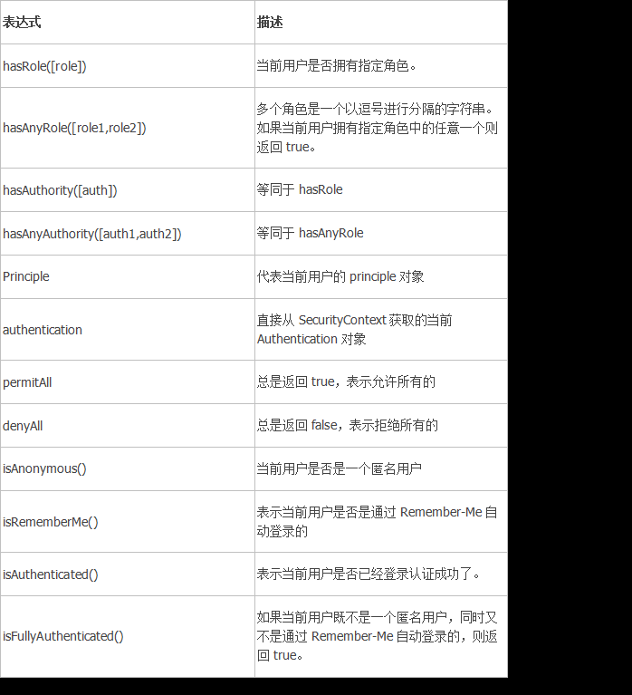

# 项目介绍 
    本项目用于实现一个后台管理系统，后端采用ssm整合方式实现，前端框架采用jsp+adminLTE。


## mybatis分页插件 - PageHelper介绍
    PageHelper是国内非常优秀的一款开源的mybatis分页插件，它支持基本主流与常用的数据库，例如mysql、oracle、mariaDB、DB2、SQLite、Hsqldb等。
    本项目在 github 的项目地址：https://github.com/pagehelper/Mybatis-PageHelper
    本项目在 gitosc 的项目地址：http://git.oschina.net/free/Mybatis_PageHelper

### PageHelper使用方法 
1、引入maven依赖 
```properties
<dependency>
    <groupId>com.github.pagehelper</groupId>
    <artifactId>pagehelper</artifactId>
    <version>5.1.2</version>
</dependency>
```

2、配置PageHelper 
1） 在 MyBatis xml文件中配置拦截器插件
```xml
<!--
    plugins在配置文件中的位置必须符合要求，否则会报错，顺序如下: 
        properties?, settings?, typeAliases?, typeHandlers?, objectFactory?,objectWrapperFactory?, plugins?, environments?, databaseIdProvider?, mappers? 
--> 
<plugins> 
    <!-- com.github.pagehelper为PageHelper类所在包名 --> 
    <plugin interceptor="com.github.pagehelper.PageInterceptor">
        <!-- 使用下面的方式配置参数，后面会有所有的参数介绍 --> 
        <property name="param1" value="value1"/> 
    </plugin> 
</plugins>
```

2) 在 Spring 配置文件中配置拦截器插件
```xml
<bean id="sqlSessionFactory" class="org.mybatis.spring.SqlSessionFactoryBean"> 
    <!-- 注意其他配置 --> 
    <property name="plugins"> 
        <array> 
            <bean class="com.github.pagehelper.PageInterceptor"> 
                <property name="properties"> 
                    <!--使用下面的方式配置参数，一行配置一个 --> 
                    <value> params=value1 </value> 
                </property> 
            </bean> 
        </array> 
    </property> 
</bean>
```
3） 使用方法
PageHelper.startPage 静态方法调用（重点）
这种方式是我们要掌握的 在你需要进行分页的 MyBatis 查询方法前调用PageHelper.startPage 静态方法即可，紧
跟在这个方法后的第一个MyBatis 查询方法会被进行分页。
```text
PageHelper.startPage(page, size);
return ordersDao.findAll();
```

4） PageHelper参数介绍 
```text
1. helperDialect ：分页插件会自动检测当前的数据库链接，自动选择合适的分页方式。 你可以配置helperDialect 属性来指定分页插件使用哪种方言。配置时，可以使用下面的缩写值：oracle , mysql , mariadb , sqlite , hsqldb , postgresql , db2 , sqlserver , informix , h2 , sqlserver201 2 , derby 
   特别注意：使用 SqlServer2012 数据库时，需要手动指定为 sqlserver2012 ，否则会使用 SqlServer2005 的方式进行分页。你也可以实现 AbstractHelperDialect ，然后配置该属性为实现类的全限定名称即可使用自定义的实现方法。
2. offsetAsPageNum ：默认值为 false ，该参数对使用 RowBounds 作为分页参数时有效。 当该参数设置为true 时，会将 RowBounds 中的 offset 参数当成 pageNum 使用，可以用页码和页面大小两个参数进行分页。
3. rowBoundsWithCount ：默认值为 false ，该参数对使用 RowBounds 作为分页参数时有效。 当该参数设置为 true 时，使用 RowBounds 分页会进行 count 查询。
4. pageSizeZero ：默认值为 false ，当该参数设置为 true 时，如果 pageSize=0 或者 RowBounds.limit = 0 就会查询出全部的结果（相当于没有执行分页查询，但是返回结果仍然是 Page 类型）。
5. reasonable ：分页合理化参数，默认值为 false 。当该参数设置为 true 时， pageNum<=0 时会查询第一页， pageNum>pages （超过总数时），会查询最后一页。默认 false 时，直接根据参数进行查询。
6. params ：为了支持 startPage(Object params) 方法，增加了该参数来配置参数映射，用于从对象中根据属性名取值， 可以配置 pageNum,pageSize,count,pageSizeZero,reasonable ，不配置映射的用默认值， 默认值为pageNum=pageNum;pageSize=pageSize;count=countSql;reasonable=reasonable;pageSizeZero=pageSizeZero 。
7. supportMethodsArguments ：支持通过 Mapper 接口参数来传递分页参数，默认值 false ，分页插件会从查询方法的参数值中，自动根据上面 params 配置的字段中取值，查找到合适的值时就会自动分页。 使用方法可以参考测试代码中的 com.github.pagehelper.test.basic 包下的 ArgumentsMapTest 和 ArgumentsObjTest 。 
8. autoRuntimeDialect ：默认值为 false 。设置为 true 时，允许在运行时根据多数据源自动识别对应方言的分页 （不支持自动选择 sqlserver2012 ，只能使用 sqlserver ），用法和注意事项参考下面的场景五。 
9. closeConn ：默认值为 true 。当使用运行时动态数据源或没有设置 helperDialect 属性自动获取数据库类型时，会自动获取一个数据库连接， 通过该属性来设置是否关闭获取的这个连接，默认 true 关闭，设置为false 后，不会关闭获取的连接，这个参数的设置要根据自己选择的数据源来决定。
```


## Spring Security 

### 一、Spring Security介绍
    Spring Security 的前身是 Acegi Security ，是 Spring 项目组中用来提供安全认证服务的框架。(https://projects.spring.io/spring-security/) Spring Security 为基于J2EE企业应用软件提供了全面安全服务。特别是使用领先的J2EE解决方案-Spring框架开发的企业软件项目。人们使用Spring Security有很多种原因，不过通常吸引他们的是在J2EE Servlet规范或EJB规范中找不到典型企业应用场景的解决方案。 特别要指出的是他们不能再WAR 或 EAR 级别进行移植。这样，如果你更换服务器环境，就要，在新的目标环境进行大量的工作，对你的应用系统进行重新配 置安全。使用Spring Security 解决了这些问题，也为你提供很多有用的，完全可以指定的其他安全特性。 安全包括两个主要操作。
    “认证”，是为用户建立一个他所声明的主体。主题一般式指用户，设备或可以在你系 统中执行动作的其他系统。
    “授权”指的是一个用户能否在你的应用中执行某个操作，在到达授权判断之前，身份的主题已经由 身份验证过程建立了。
    这些概念是通用的，不是Spring Security特有的。在身份验证层面，Spring Security广泛支持各种身份验证模式，这些验证模型绝大多数都由第三方提供，或则正在开发的有关标准机构提供的，例如 Internet Engineering TaskForce.作为补充，Spring Security 也提供了自己的一套验证功能。

### 二、使用步骤 
1）maven依赖 
```xml
<dependencies>
    <dependency> 
        <groupId>org.springframework.security</groupId> 
        <artifactId>spring-security-web</artifactId> 
        <version>5.0.1.RELEASE</version> 
    </dependency> 
    <dependency> 
        <groupId>org.springframework.security</groupId> 
        <artifactId>spring-security-config</artifactId> 
        <version>5.0.1.RELEASE</version> 
    </dependency> 
</dependencies>
```

2）在web.xml文件中配置过滤器 
```xml
<?xml version="1.0" encoding="UTF-8"?>
<web-app xmlns:xsi="http://www.w3.org/2001/XMLSchema-instance"
         xmlns="http://java.sun.com/xml/ns/javaee"
         xsi:schemaLocation="http://java.sun.com/xml/ns/javaee http://java.sun.com/xml/ns/javaee/web-app_2_5.xsd"
         version="2.5">
    <display-name>SpringSecurity</display-name>

    <context-param>
        <param-name>contextConfigLocation</param-name>
        <param-value>classpath:spring-security.xml</param-value>
    </context-param>
    <listener>
        <listener-class>org.springframework.web.context.ContextLoaderListener</listener-class>
    </listener>
    <filter> <!-- springSecurityFilterChain名字不能改变 -->
        <filter-name>springSecurityFilterChain</filter-name>
        <filter-class>org.springframework.web.filter.DelegatingFilterProxy</filter-class>
    </filter>
    <filter-mapping>
        <filter-name>springSecurityFilterChain</filter-name>
        <url-pattern>/*</url-pattern>
    </filter-mapping>

    <welcome-file-list>
        <welcome-file>index.html</welcome-file>
        <welcome-file>index.jsp</welcome-file>
    </welcome-file-list>

</web-app>
```

3) spring security配置
```xml
<?xml version="1.0" encoding="UTF-8"?>
<beans xmlns="http://www.springframework.org/schema/beans"
       xmlns:security="http://www.springframework.org/schema/security"
       xmlns:xsi="http://www.w3.org/2001/XMLSchema-instance"
       xsi:schemaLocation="http://www.springframework.org/schema/beans
http://www.springframework.org/schema/beans/spring-beans.xsd
http://www.springframework.org/schema/security
http://www.springframework.org/schema/security/spring-security.xsd">

    <!-- 配置不过滤的资源（静态资源及登录相关） -->
    <security:http security="none" pattern="/login.html"/>
    <security:http security="none" pattern="/failer.html"/>
    <!-- 
        设置http的auto-config=”true”时Spring Security自动为我们生成登录页面。
    -->
    <security:http auto-config="true" use-expressions="false">

        <!-- 配置资料连接，表示任意路径都需要ROLE_USER权限 -->
        <security:intercept-url pattern="/**" access="ROLE_USER"/>

        <!-- 自定义登陆页面：
            login-page 自定义登陆页面
            authentication-failure-url 用户权限校验失败之后才会跳转到这个页面，如果数据库中没有这个用户则不会跳转到这个页面。
            default-target-url 登陆成功后跳转的页面。
            注：登陆页面用户名固定 username，密码 password，action:login
        -->
        <security:form-login login-page="/login.html"
                             login-processing-url="/login"
                             username-parameter="username"
                             password-parameter="password"
                             authentication-failure-url="/failer.html"
                             default-target-url="/success.html"
                             authentication-success-forward-url="/success.html"
        />

        <!-- 关闭CSRF,默认是开启的 -->
        <security:csrf disabled="true"/>

    </security:http>

    <!-- 认证管理 -->
    <security:authentication-manager>
        <security:authentication-provider>
            <security:user-service>
                <security:user name="user" password="{noop}user" authorities="ROLE_USER"/>
                <security:user name="admin" password="{noop}admin" authorities="ROLE_ADMIN"/>
            </security:user-service>
        </security:authentication-provider>
    </security:authentication-manager>
    
</beans>
```

### 三、Spring Security使用数据库登录认证 
    在Spring Security中如果想要使用数据进行认证操作，有很多种操作方式，这里我们介绍使用UserDetails、UserDetailsService来完成操作。

UserDetails:
```java
public interface UserDetails extends Serializable {
    Collection<? extends GrantedAuthority> getAuthorities();
    String getPassword();
    String getUsername();
    boolean isAccountNonExpired();
    boolean isAccountNonLocked();
    boolean isCredentialsNonExpired();
    boolean isEnabled();
}
```
    UserDetails是一个接口，我们可以认为UserDetails作用是于封装当前进行认证的用户信息，但由于其是一个接口，所以我们可以对其进行实现，也可以使用Spring Security提供的一个UserDetails的实现类User来完成操作

User:
```java
public class User implements UserDetails, CredentialsContainer {
    private final String username;
    private String password;
    private final Set<GrantedAuthority> authorities;
    private final boolean accountNonExpired; //帐户是否过期 
    private final boolean accountNonLocked; //帐户是否锁定 
    private final boolean credentialsNonExpired; //认证是否过期 
    private final boolean enabled; //帐户是否可用 
}
```

UserDetailsService:
```java
public interface UserDetailsService { 
    UserDetails loadUserByUsername(String username) throws UsernameNotFoundException; 
}
```
    上面将UserDetails与UserDetailsService做了一个简单的介绍，那么我们具体如何完成Spring Security的数据库认证操作哪，我们通过用户管理中用户登录来完成Spring Security的认证操作。

### 四、用户退出
```xml
<security:logout invalidate-session="true" logout-url="/logout.do" logout-success- url="/login.jsp" />
```
解释：当访问/logout.do地址时，用户退出登录

### 五、权限控制 
1、服务端权限控制
    在服务器端我们可以通过Spring security提供的注解对方法来进行权限控制。Spring Security在方法的权限控制上支持三种类型的注解，JSR-250注解、@Secured注解和支持表达式的注解，这三种注解默认都是没有启用的，需要单独通过global-method-security元素的对应属性进行启用

1.1 开启注解使用
1.1.1 配置文件开启
```xml
<security:global-method-security jsr250-annotations="enabled"/>
<security:global-method-security secured-annotations="enabled"/>
<security:global-method-security pre-post-annotations="disabled"/>
```
1.1.2 注解开启
@EnableGlobalMethodSecurity ：Spring Security默认是禁用注解的，要想开启注解，需要在继承WebSecurityConfigurerAdapter的类上加@EnableGlobalMethodSecurity注解，并在该类中将AuthenticationManager定义为Bean。

1.2 JSR-250注解使用方法 
1.2.1 导入maven依赖 
```xml
        <dependency>
            <groupId>javax.annotation</groupId>
            <artifactId>jsr250-api</artifactId>
            <version>1.0</version>
        </dependency>
```

1.2.2 开启注解 
```xml
<security:global-method-security jsr250-annotations="enabled"/>
```

1.2.3 在指定的方法上指定权限注解
@RolesAllowed表示访问对应方法时所应该具有的角色
示例： @RolesAllowed({"USER", "ADMIN"}) 该方法只要具有"USER", "ADMIN"任意一种权限就可以访问。这里可以省 略前缀ROLE_，实际的权限可能是ROLE_ADMIN
@PermitAll表示允许所有的角色进行访问，也就是说不进行权限控制
@DenyAll是和PermitAll相反的，表示无论什么角色都不能访问

1.3 @Secured注解
spring security提供权限控制注解；
@Secured注解标注的方法进行权限控制的支持，其值默认为disabled。

1.3.1 开启注解支持 
```java
<security:global-method-security secured-annotations="enabled"/>
```

1.3.2 在指定方法上使用 
示例： 
```java
@Secured("IS_AUTHENTICATED_ANONYMOUSLY") 
public Account readAccount(Long id);
@Secured("ROLE_TELLER")
```

注意：使用该注解需要提供ROLE_前缀

1.4 支持表达式的注解

1.4.1 开启注解支持 
```xml
<security:global-method-security pre-post-annotations="disabled"/>
```

1.4.2 使用注解 

@PreAuthorize 在方法调用之前,基于表达式的计算结果来限制对方法的访问
示例： 
@PreAuthorize("#userId == authentication.principal.userId or hasAuthority(‘ADMIN’)") 
void changePassword(@P("userId") long userId ){ } 
这里表示在changePassword方法执行之前，判断方法参数userId的值是否等于principal中保存的当前用户的 userId，或者当前用户是否具有ROLE_ADMIN权限，两种符合其一，就可以访问该方法。

@PostAuthorize 允许方法调用,但是如果表达式计算结果为false,将抛出一个安全性异常
示例： 
@PostAuthorize 
User getUser("returnObject.userId == authentication.principal.userId or hasPermission(returnObject, 'ADMIN')");
@PostFilter 允许方法调用,但必须按照表达式来过滤方法的结果
@PreFilter 允许方法调用,但必须在进入方法之前过滤输入值

注意：支持spel表达式
Spring Security允许我们在定义URL访问或方法访问所应有的权限时使用Spring EL表达式，在定义所需的访问权限时如果对应的表达式返回结果为true则表示拥有对应的权限，反之则无。Spring Security可用表达式对象的基类是SecurityExpressionRoot，其为我们提供了如下在使用Spring EL表达式对URL或方法进行权限控制时通用的内置表达式。



2、页面端权限控制
在jsp页面中我们可以使用spring security提供的权限标签来进行权限控制

2.1 maven导入
```xml
<dependency> 
    <groupId>org.springframework.security</groupId> 
    <artifactId>spring-security-taglibs</artifactId> 
    <version>version</version> 
</dependency>
```

2.2 页面导入
```html
<%@taglib uri="http://www.springframework.org/security/tags" prefix="security"%>
```

2.3 常用标签
在jsp中我们可以使用以下三种标签，其中authentication代表的是当前认证对象，可以获取当前认证对象信息，例如用户名。其它两个标签我们可以用于权限控制

2.3.1 authentication
<security:authentication property="" htmlEscape="" scope="" var=""/>
property： 只允许指定Authentication所拥有的属性，可以进行属性的级联获取，如“principle.username”，不允许直接通过方法进行调用
htmlEscape：表示是否需要将html进行转义。默认为true。
scope：与var属性一起使用，用于指定存放获取的结果的属性名的作用范围，默认我pageContext。Jsp中拥有的作用范围都进行进行指定
var： 用于指定一个属性名，这样当获取到了authentication的相关信息后会将其以var指定的属性名进行存放，默认是存放在pageConext中

2.3.2 authorize
authorize是用来判断普通权限的，通过判断用户是否具有对应的权限而控制其所包含内容的显示
<security:authorize access="" method="" url="" var=""></security:authorize>
access： 需要使用表达式来判断权限，当表达式的返回结果为true时表示拥有对应的权限
method：method属性是配合url属性一起使用的，表示用户应当具有指定url指定method访问的权限，
method的默认值为GET，可选值为http请求的7种方法
url：url表示如果用户拥有访问指定url的权限即表示可以显示authorize标签包含的内容
var：用于指定将权限鉴定的结果存放在pageContext的哪个属性中

2.3.3 accesscontrollist
accesscontrollist标签是用于鉴定ACL权限的。其一共定义了三个属性：hasPermission、domainObject和var，其中前两个是必须指定的
<security:accesscontrollist hasPermission="" domainObject="" var=""></security:accesscontrollist>
hasPermission：hasPermission属性用于指定以逗号分隔的权限列表
domainObject：domainObject用于指定对应的域对象
var：var则是用以将鉴定的结果以指定的属性名存入pageContext中，以供同一页面的其它地方使用

